# shuo-BI

利用AI能力，用户输入想要处理数据以及如何处理生成报表。

# 需求分析

1. 智能分析：用户输入目标和原始数据(图标类型)，可以自动生成图标和分析结论
2. 图表管理(增删改查)
3. 图表生成的异步化(消息队列)
4. 对接 AI 能力

# 技术选型

后端

1. Spring Boot (万用 Java 后端项目模板，快速搭建基础框架，避免重复写代码)
2. MySQL数据库
3. MyBatis Plus数据访问框架
4. 消息队列(RabbitMQ)
5. AI 能力(Deepseek)
6. Excel 的上传和数据的解析(Easy Excel)
7. Swagger + Knife4j 项目接口文档
8. Hutool 工具库


前端

1. React
2. 开发框架 Umi + Ant Design Pro
3. 可视化开发库(Echarts + HighCharts + AntV) 
4. umi openapi 代码生成(自动生成后端调用代码) 


# 前端项目初始化

[文档总览 - Ant Design Pro](https://pro.ant.design/zh-CN/docs/overview)

根据文档创建，并运行测试

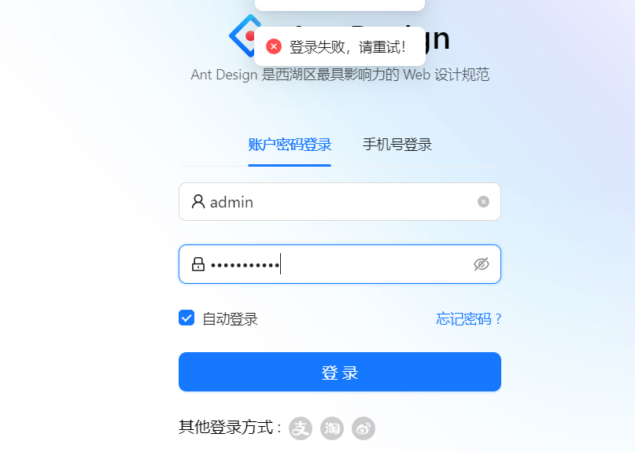

运行成功，

tips: 用npm run dev 启动是请求后端，现在我们还没写后端，可以使用start来启动，模拟数据启动


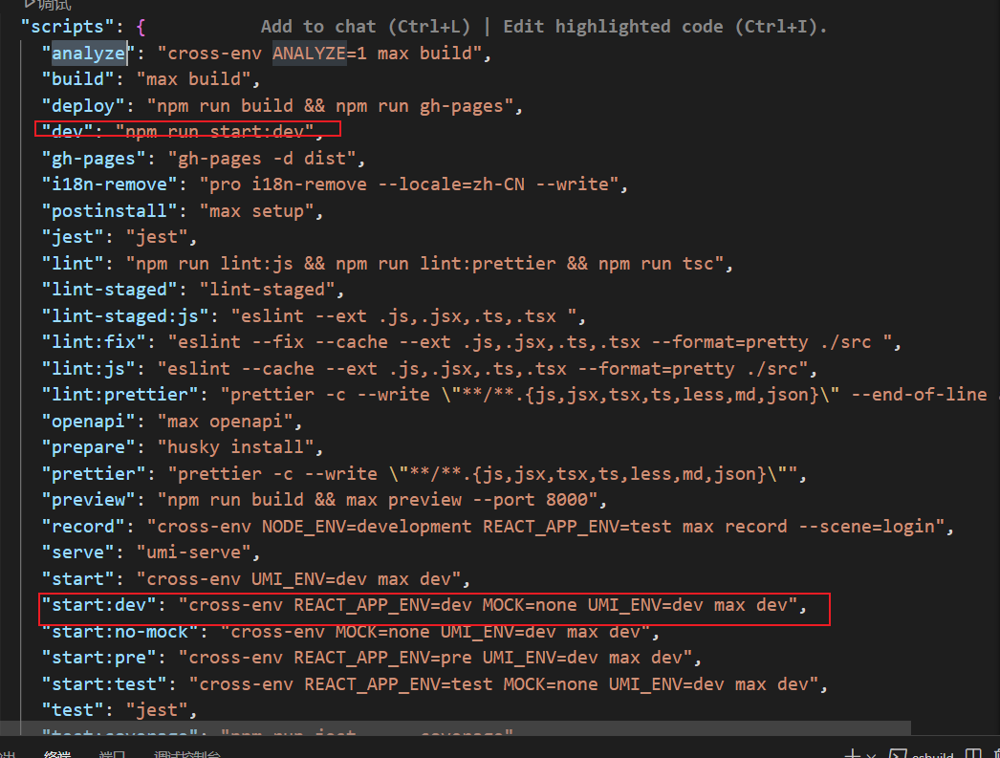

登入成功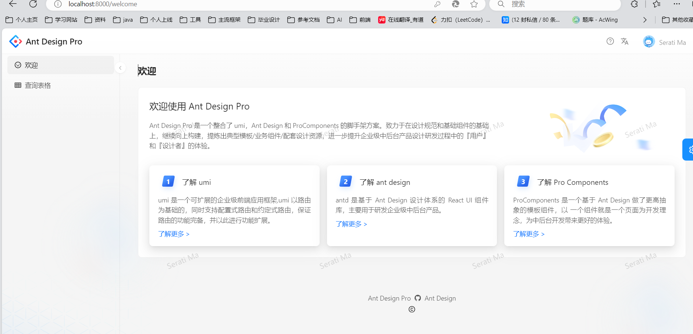

移除不需要的部分


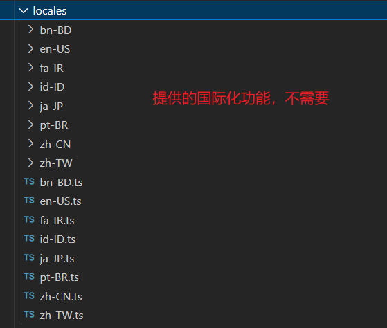

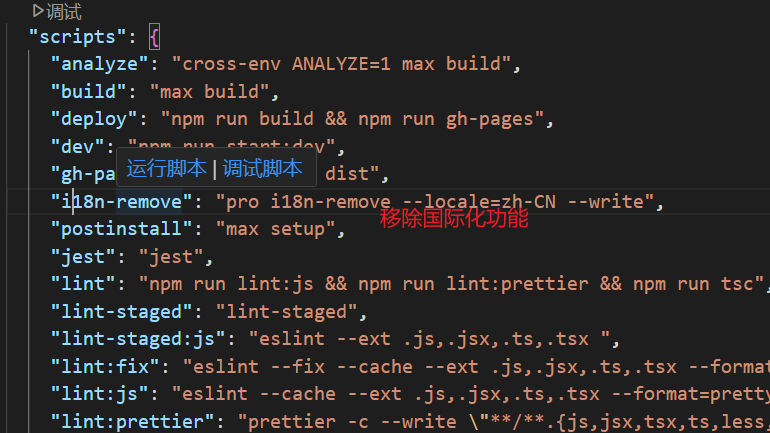

报错就github上搜。

移除国际化后

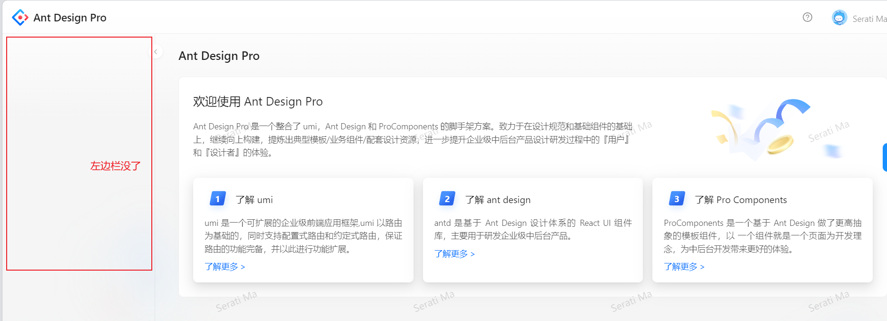

修改route.ts

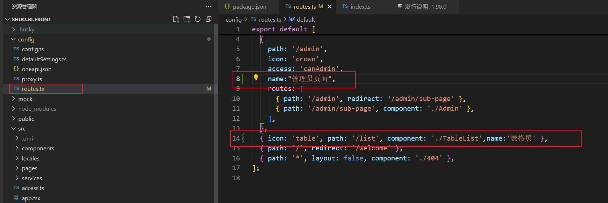

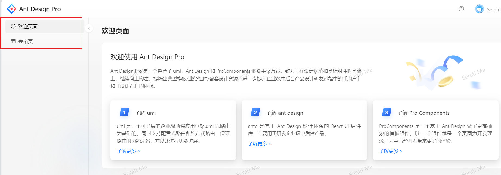

移除国际化残留文件，

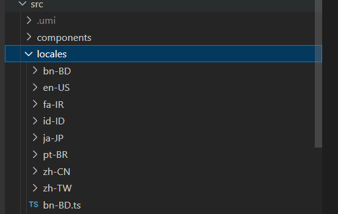

移除mock数据

删除测试文件

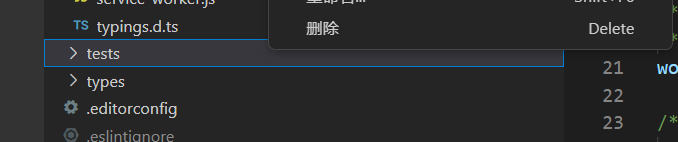

删除types

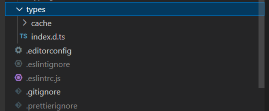

删除测试框架

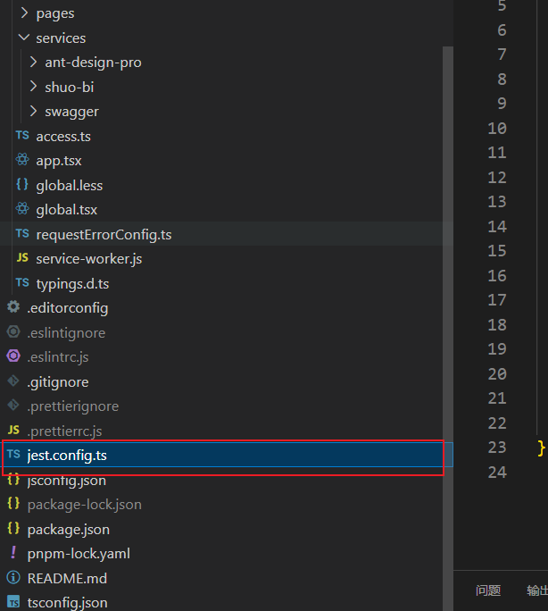

替换logo： [iconfont-阿里巴巴矢量图标库](https://www.iconfont.cn/search/index)

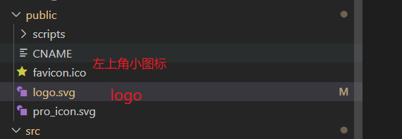

替换左上角图表

png -> ico


全局替换title


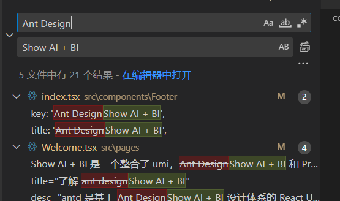


# 库表设计

```sql
create  database  shuo_bi;

use shuo_bi;
-- 用户表
create table if not exists user
(
    id           bigint auto_increment comment 'id' primary key,
    userAccount  varchar(256)                           not null comment '账号',
    userPassword varchar(512)                           not null comment '密码',
    userName     varchar(256)                           null comment '用户昵称',
    userAvatar   varchar(1024)                          null comment '用户头像',
    userRole     varchar(256) default 'user'            not null comment '用户角色：user/admin',
    createTime   datetime     default CURRENT_TIMESTAMP not null comment '创建时间',
    updateTime   datetime     default CURRENT_TIMESTAMP not null on update CURRENT_TIMESTAMP comment '更新时间',
    isDelete     tinyint      default 0                 not null comment '是否删除',
    index idx_userAccount (userAccount)
) comment '用户' collate = utf8mb4_unicode_ci;


-- 图表信息表
create table if not exists chart
(
    id           bigint auto_increment comment 'id' primary key,
    goal				 text null comment'分析目标',
    chartData		 text null comment'图表数据',
    chartType		 varchar(128) null comment'图表类型',
    genChart		 text null comment'生成的图表数据',
    genResult		 text null comment'生成的分析结论',
    userId			 bigint null comment'创建用户 id',
    createTime   datetime     default CURRENT_TIMESTAMP not null comment '创建时间',
    updateTime   datetime     default CURRENT_TIMESTAMP not null on update CURRENT_TIMESTAMP comment '更新时间',
    isDelete     tinyint      default 0                 not null comment '是否删除'
) comment '图表信息表' collate = utf8mb4_unicode_ci;
```

# 前后端联调

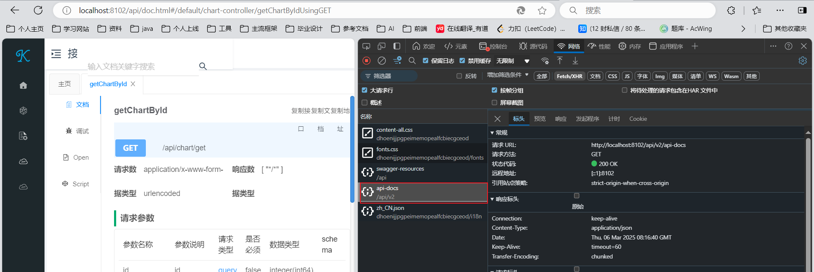

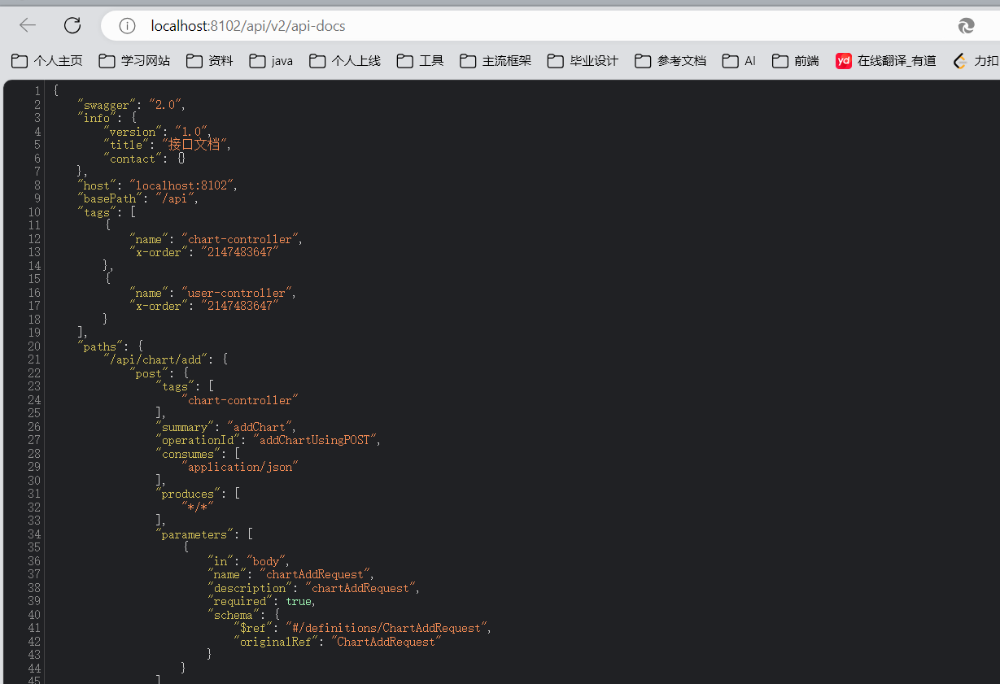

前端根据后端接口自动生成axios请求

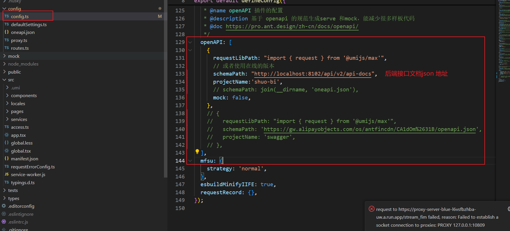

点击脚本 openapi

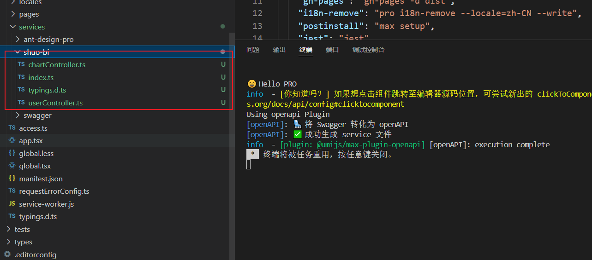

生成了axios.

测试一下

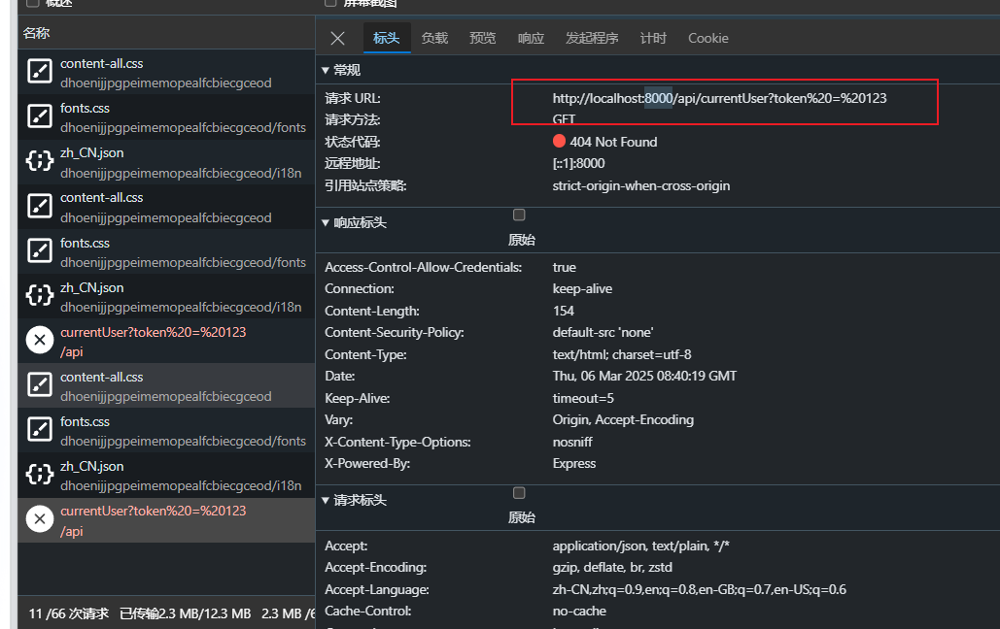

我们要修改request 的请求路径

src 下 app.tsx

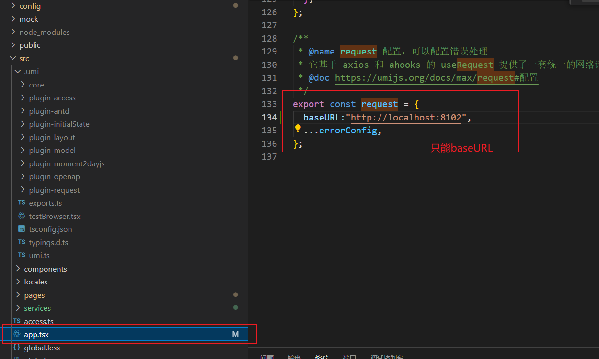


地址对了

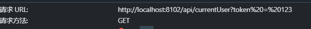

# 登录页面

点击登录，发送axios 请求，没啥。

需要注意的是表单的数据对应接口。

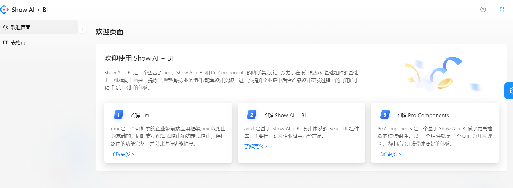

总结一下，表单参数名和前端请求的一致，通用的拦截器看看了解了解，获得当前用户信息的接口要改成自己的，拦截器携带seesionid。

# 注册页面

路由配置，

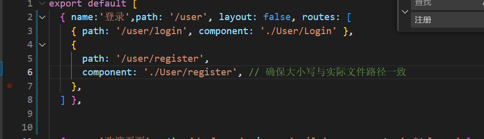


根据登录页面修改，主要修改请求axios，表单参数名称

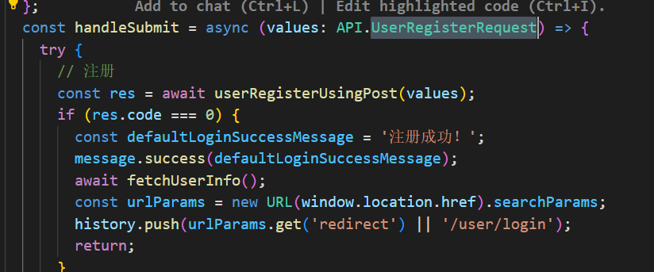


# 登录注册bug修复

## 头像bug

一直 转圈，我要修改就先找该元素。

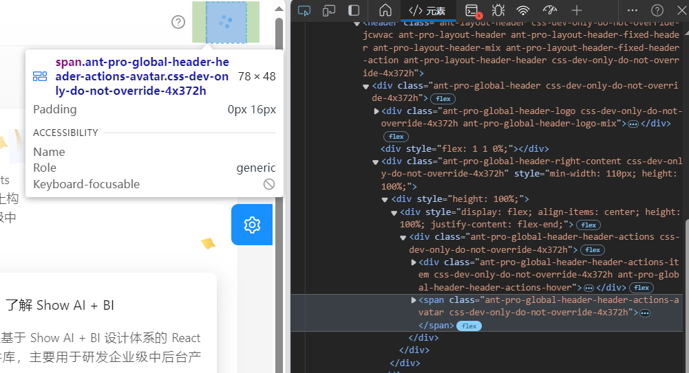

找到原因，解决

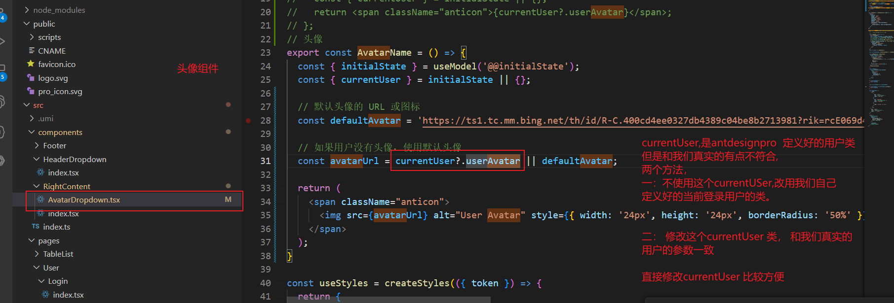

页面

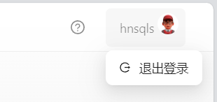


退出登录

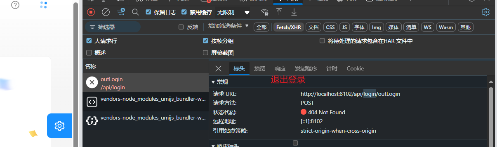

原因请求的接口不对， 改一下请求的接口，以及参数，（当然了openapi 可以自动生成，我们只需要修改）

解决

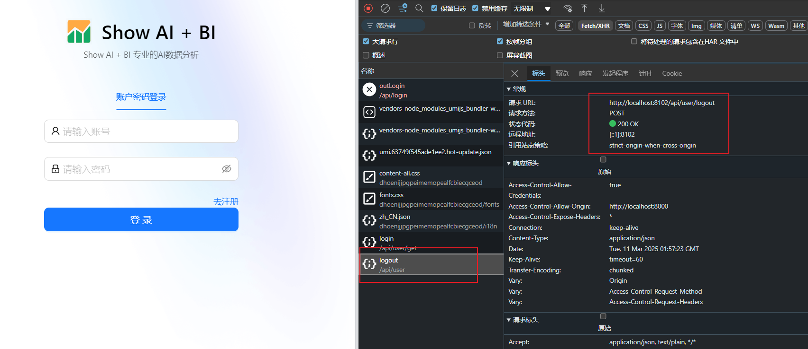

# AI生成BI 后端

用户输入 数据（excel），目标，生成的图表类型

后端接收文件，文件进行压缩，编写提示词给ai,生成数据。前端接收json数据渲染。

1. 用户输入

a. 分析目标

b. 上传原始数据(excel)

c. 更精细化地控制图表:比如图表类型、图表名称等

1. 后端校验

a. 校验用户的输入否合法(比如长度)

b. 成本控制(次数统计和校验、鉴权等)

1. 把处理后的数据输入给 AI 模型(调用 Al 接口，让 AI 模型给我们提供图表信息、结论文本
2. 图表信息(是一段 json 配置，是一段代码)、结论文本在前端进行展示


发现chart表不合理，添加chartName 字段


## 原生数据压缩

使用csv 压缩 excel 数据和提取

使用EazyExcel 读取excel文件。然后转成csv

引入依赖

```xml
    <!-- https://github.com/alibaba/easyexcel -->
        <dependency>
            <groupId>com.alibaba</groupId>
            <artifactId>easyexcel</artifactId>
            <version>3.1.1</version>
        </dependency>
```


编写工具类，用来读取excel并且转成csv

```java
/**
 * Excel 工具类
 */
@Slf4j
public class ExcelUtils {

    /**
     * excel 转csv
     * @param multiPartFile
     * @return
     */

    public  static String excelToCsv(MultipartFile multiPartFile){

//        File file = null;
//        try {
//             file = ResourceUtils.getFile("classpath:网站数据.xlsx");
//
//        }catch (Exception e){
//            e.printStackTrace();
//        }


        //读 excel
        List<Map<Integer,String>> list = null;
        try {
            list = EasyExcel.read(multiPartFile.getInputStream())
                    .excelType(ExcelTypeEnum.XLSX)
                    .sheet()
                    .headRowNumber(0)
                    .doReadSync();
        } catch (IOException e) {
            log.error("excel 转csv 失败",e);
            throw new RuntimeException(e);
        }


        //数据为 空
        if (list == null || list.size() == 0){
            return "";
        }

        //数据转csv
        StringBuilder stringBuilder = new StringBuilder();
        //表头
        LinkedHashMap<Integer, String> headerMap = (LinkedHashMap)list.get(0);
        List<String> headerList = headerMap.values().stream().filter(ObjectUtils::isNotEmpty).collect(Collectors.toList());
//        System.out.println(StringUtils.join(headerList,","));
        stringBuilder.append(StringUtils.join(headerList,",")).append("\n");

        //读取每一行
        for (int i = 1; i < list.size(); i++) {
            LinkedHashMap<Integer, String> dataMap = (LinkedHashMap)list.get(i);
            List<String> dateList = dataMap.values().stream().filter(ObjectUtils::isNotEmpty).collect(Collectors.toList());
//            System.out.println(StringUtils.join(dateList,","));
            stringBuilder.append(StringUtils.join(dateList,",")).append("\n");

        }

        return stringBuilder.toString();

    }

    public static void main(String[] args) {
        excelToCsv(null);
    }
}
```


## 调用AI

火山引擎

```xml
<!--        AI 接入 火山引擎 Deepseek https://www.volcengine.com/experience/ark-->
        <dependency>
            <groupId>com.volcengine</groupId>
            <artifactId>volcengine-java-sdk-ark-runtime</artifactId>
            <version>0.1.153</version>
        </dependency>
```

[火山方舟大模型体验中心-火山引擎](https://www.volcengine.com/experience/ark)

看示例的写法，最简单的直接就引入，然后测试是否能引入成功。

```java
package com.ls.bi;


import com.volcengine.ark.runtime.model.completion.chat.ChatCompletionRequest;
import com.volcengine.ark.runtime.model.completion.chat.ChatMessage;
import com.volcengine.ark.runtime.model.completion.chat.ChatMessageRole;
import com.volcengine.ark.runtime.service.ArkService;
import okhttp3.ConnectionPool;
import okhttp3.Dispatcher;

import java.util.ArrayList;
import java.util.List;
import java.util.concurrent.TimeUnit;

public class AITest {
    // 请确保您已将 API Key 存储在环境变量 ARK_API_KEY 中
// 初始化Ark客户端，从环境变量中读取您的API Key
        // 从环境变量中获取您的 API Key。此为默认方式，您可根据需要进行修改
//        static String apiKey = System.getenv("ARK_API_KEY");
        static String apiKey = "xxxxxxxxxxxx";


        // 此为默认路径，您可根据业务所在地域进行配置
        static String baseUrl = "https://ark.cn-beijing.volces.com/api/v3";
        static ConnectionPool connectionPool = new ConnectionPool(5, 1, TimeUnit.SECONDS);
        static Dispatcher dispatcher = new Dispatcher();
        static ArkService service = ArkService.builder().dispatcher(dispatcher).connectionPool(connectionPool).baseUrl(baseUrl).apiKey(apiKey).build();

        public static void main(String[] args) {
            System.out.println("\n----- standard request -----");
            // 构造消息
            final List<ChatMessage> messages = new ArrayList<>();
            final ChatMessage systemMessage = ChatMessage.builder().role(ChatMessageRole.SYSTEM).content("你是人工智能助手.").build();
            final ChatMessage userMessage = ChatMessage.builder().role(ChatMessageRole.USER).content("常见的十字花科植物有哪些？").build();
            messages.add(systemMessage);
            messages.add(userMessage);


            // 封装请求
            ChatCompletionRequest chatCompletionRequest = ChatCompletionRequest.builder()
                    // 指定您创建的方舟推理接入点 ID，此处已帮您修改为您的推理接入点 ID
                    .model("doubao-pro-32k-character-241215")
                    .messages(messages)
                    .build();

            // 发起请求获取结果
            service.createChatCompletion(chatCompletionRequest).getChoices().forEach(choice -> System.out.println(choice.getMessage().getContent()));

//            System.out.println("\n----- streaming request -----");
//            final List<ChatMessage> streamMessages = new ArrayList<>();
//            final ChatMessage streamSystemMessage = ChatMessage.builder().role(ChatMessageRole.SYSTEM).content("你是人工智能助手.").build();
//            final ChatMessage streamUserMessage = ChatMessage.builder().role(ChatMessageRole.USER).content("常见的十字花科植物有哪些？").build();
//            streamMessages.add(streamSystemMessage);
//            streamMessages.add(streamUserMessage);
//
//            ChatCompletionRequest streamChatCompletionRequest = ChatCompletionRequest.builder()
//                    // 指定您创建的方舟推理接入点 ID，此处已帮您修改为您的推理接入点 ID
//                    .model("doubao-pro-32k-character-241215")
//                    .messages(messages)
//                    .build();
//
//            service.streamChatCompletion(streamChatCompletionRequest)
//                    .doOnError(Throwable::printStackTrace)
//                    .blockingForEach(
//                            choice -> {
//                                if (choice.getChoices().size() > 0) {
//                                    System.out.print(choice.getChoices().get(0).getMessage().getContent());
//                                }
//                            }
//                    );

            service.shutdownExecutor();
        }

}


```

核心逻辑就是

1. 获取AIService

```java
       
 		static String apiKey = "xxxxxxxxxxxx";
		static String baseUrl = "https://ark.cn-beijing.volces.com/api/v3";
        static ConnectionPool connectionPool = new ConnectionPool(5, 1, TimeUnit.SECONDS);
        static Dispatcher dispatcher = new Dispatcher();
        static ArkService service = ArkService.builder().dispatcher(dispatcher).connectionPool(connectionPool).baseUrl(baseUrl).apiKey(apiKey).build();
```

2. 封装消息

主要是系统prompt 和用户prompt

```java
   final List<ChatMessage> messages = new ArrayList<>();
            final ChatMessage systemMessage = ChatMessage.builder().role(ChatMessageRole.SYSTEM).content("你是人工智能助手.").build();
            final ChatMessage userMessage = ChatMessage.builder().role(ChatMessageRole.USER).content("常见的十字花科植物有哪些？").build();
            messages.add(systemMessage);
            messages.add(userMessage);
```

3. 封装请求

指定模型，以及传入消息

```java
            ChatCompletionRequest chatCompletionRequest = ChatCompletionRequest.builder()
                    // 指定您创建的方舟推理接入点 ID，此处已帮您修改为您的推理接入点 ID
                    .model("doubao-pro-32k-character-241215")
                    .messages(messages)
                    .build();
```

4. 利用AIservice 发送消息,获得响应结果

```java
service.createChatCompletion(chatCompletionRequest).getChoices().forEach(choice -> System.out.println(choice.getMessage().getContent()));
```

调用成功

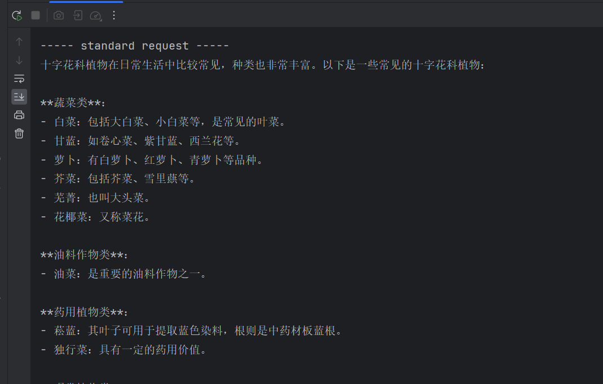

大题逻辑是上述那样， 我们可以稍微封装一下，以便使用.


先写一个AI的配置类，获取AI的请求服务。然后在编写工具类（传入消息，发送请求获取结果）。

编写 AIServiceConfig

主要是封装这部分

```java
 		static String apiKey = "xxxxxxxxxxxx";
		static String baseUrl = "https://ark.cn-beijing.volces.com/api/v3";
        static ConnectionPool connectionPool = new ConnectionPool(5, 1, TimeUnit.SECONDS);
        static Dispatcher dispatcher = new Dispatcher();
        static ArkService service = ArkService.builder().dispatcher(dispatcher).connectionPool(connectionPool).baseUrl(baseUrl).apiKey(apiKey).build();
```

```java
@Configuration
@ConfigurationProperties(prefix = "ai")
@Data
public class AIConfig {

    // apiKey 自动从配置文件获取 可以选择local.yaml
    private String apiKey;

    /**
     * AI 请求服务
     * @return
     */
    @Bean
    public ArkService AIService(){
        //
        ConnectionPool connectionPool = new ConnectionPool(5, 1, TimeUnit.SECONDS);
        Dispatcher dispatcher = new Dispatcher();
        ArkService service = ArkService.builder()
                .dispatcher(dispatcher)
                .connectionPool(connectionPool)
                .baseUrl("https://ark.cn-beijing.volces.com/api/v3")
                .apiKey(apiKey).build();

        return service;
    }

}

```

记得配置类中编写apikey,在新建一个配置文件，applicaiton-local.yaml，忽略提交


编写工具类，方便使用

```java
package com.ls.bi.manager;

import com.ls.bi.common.ErrorCode;
import com.ls.bi.config.AiConfig;
import com.ls.bi.exception.BusinessException;
import com.volcengine.ark.runtime.model.completion.chat.ChatCompletionChoice;
import com.volcengine.ark.runtime.model.completion.chat.ChatCompletionRequest;
import com.volcengine.ark.runtime.model.completion.chat.ChatMessage;
import com.volcengine.ark.runtime.model.completion.chat.ChatMessageRole;
import com.volcengine.ark.runtime.service.ArkService;
import org.springframework.stereotype.Component;

import javax.annotation.Resource;
import java.util.ArrayList;
import java.util.List;

@Component
public class AiManager {


    /**
     * AI 服务
     */
    @Resource
    private ArkService AIService;


    /**
     * AI 默认模型 doubao
     */
    private final String Default_Model= "doubao-pro-32k-character-241215";


    /**
     * AI工具请求
     * @param systemPrompt
     * @param userPrompt
     * @return
     */
    public String doChat(String systemPrompt, String userPrompt){


        System.out.println("\n----- standard request -----");
        // 构造消息
        final List<ChatMessage> messages = new ArrayList<>();
        final ChatMessage systemMessage = ChatMessage.builder().role(ChatMessageRole.SYSTEM).content(systemPrompt).build();
        final ChatMessage userMessage = ChatMessage.builder().role(ChatMessageRole.USER).content(userPrompt).build();
        messages.add(systemMessage);
        messages.add(userMessage);


        // 封装请求
        ChatCompletionRequest chatCompletionRequest = ChatCompletionRequest.builder()
                // 指定您创建的方舟推理接入点 ID，此处已帮您修改为您的推理接入点 ID
                .model(Default_Model)
                .messages(messages)
                .build();


        // 发起请求获取结果
        List<ChatCompletionChoice> choices = AIService.createChatCompletion(chatCompletionRequest).getChoices();

        if (choices == null || choices.isEmpty()) {
            throw  new BusinessException(ErrorCode.OPERATION_ERROR,"AI生成失败");
        }

        StringBuilder stringBuilder = new StringBuilder();
        choices.forEach(choice -> stringBuilder.append(choice.getMessage().getContent()).append("\n"));

        return stringBuilder.toString();

    }


    /**
     * AI工具请求
     * @param systemPrompt
     * @param userPrompt
     * @param AiModel
     * @return
     */
    public String doChat(String systemPrompt, String userPrompt,String AiModel){


        System.out.println("\n----- standard request -----");
        // 构造消息
        final List<ChatMessage> messages = new ArrayList<>();
        final ChatMessage systemMessage = ChatMessage.builder().role(ChatMessageRole.SYSTEM).content(systemPrompt).build();
        final ChatMessage userMessage = ChatMessage.builder().role(ChatMessageRole.USER).content(userPrompt).build();
        messages.add(systemMessage);
        messages.add(userMessage);


        // 封装请求
        ChatCompletionRequest chatCompletionRequest = ChatCompletionRequest.builder()
                // 指定您创建的方舟推理接入点 ID，此处已帮您修改为您的推理接入点 ID
                .model(AiModel)
                .messages(messages)
                .build();

        // 发起请求获取结果
        List<ChatCompletionChoice> choices = AIService.createChatCompletion(chatCompletionRequest).getChoices();

        if (choices == null || choices.isEmpty()) {
            throw  new BusinessException(ErrorCode.OPERATION_ERROR,"AI生成失败");
        }

        // 解析结果
        StringBuilder stringBuilder = new StringBuilder();
        choices.forEach(choice -> stringBuilder.append(choice.getMessage().getContent()).append("\n"));

        return stringBuilder.toString();

    }


    /**
     * AI工具请求
     * @param userPrompt
     * @return
     */
    public String doChat(String userPrompt){


        System.out.println("\n----- standard request -----");
        // 构造消息
        final List<ChatMessage> messages = new ArrayList<>();
        final ChatMessage systemMessage = ChatMessage.builder().role(ChatMessageRole.SYSTEM).content("").build();
        final ChatMessage userMessage = ChatMessage.builder().role(ChatMessageRole.USER).content(userPrompt).build();
        messages.add(systemMessage);
        messages.add(userMessage);


        // 封装请求
        ChatCompletionRequest chatCompletionRequest = ChatCompletionRequest.builder()
                // 指定您创建的方舟推理接入点 ID，此处已帮您修改为您的推理接入点 ID
                .model("Default_Model")
                .messages(messages)
                .build();


        // 发起请求获取结果
        List<ChatCompletionChoice> choices = AIService.createChatCompletion(chatCompletionRequest).getChoices();

        if (choices == null || choices.isEmpty()) {
            throw  new BusinessException(ErrorCode.OPERATION_ERROR,"AI生成失败");
        }

        StringBuilder stringBuilder = new StringBuilder();
        choices.forEach(choice -> stringBuilder.append(choice.getMessage().getContent()).append("\n"));

        return stringBuilder.toString();

    }


}

```

apikey，写道其他的配置文件中，比如说application-yaml.中，忽略提交

在启动的时候，指定上启动使用的配置文件

```shell
--spring.profiles.active=local
```


## 如何让AI根据数据生成我们要求的分析图

直接不能生成图，或者说现有的aI 不能生成图的能力比较弱。

我们仅仅让AI根据数据，进行分析，生成分析数据的图表代码，利用前端的组件库(Echarts)将这些生成的代码在网页上展示

  [Echarts 支持在线调试](https://echarts.apache.org/examples/zh/editor.html?c=line-simple)。

 梳理一下，就是我们将数据给AI，让他分析数据生成图表的代码，我们根据图表代码，使用Echarts 库展示。

那就要编写prompt ,让AI生成符合要求的数据


简单的折现图趋势，就不贴图了， 测试ok


稍微复杂的就有一些问题

比如说excel,有空值，导致csv就错误

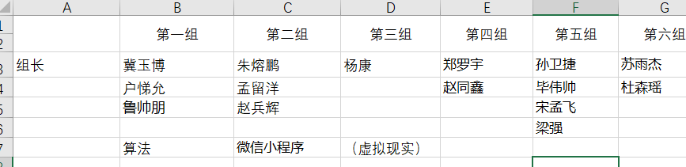

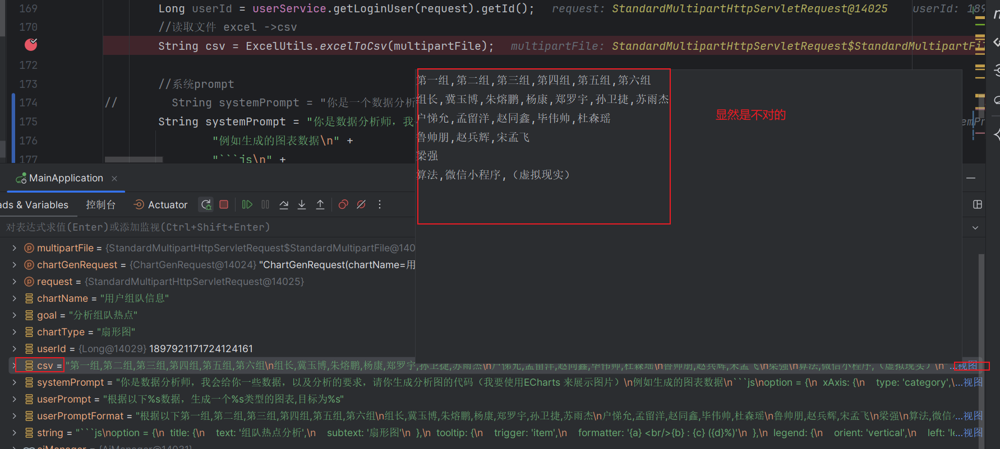

生成的数据，是可以展示的

基本可用吧

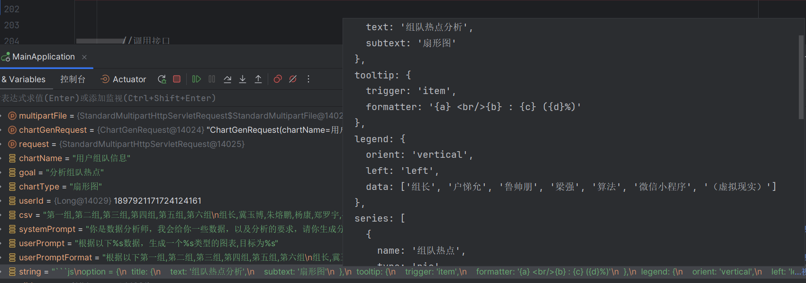

只是不太符合要求，数据给的不太行。

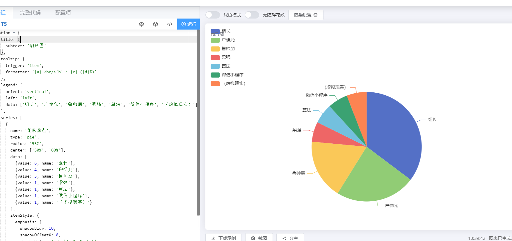

修改一下数据

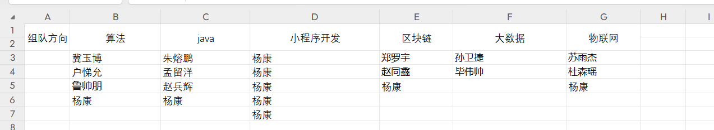

再次测试

转cvs 的问题很大啊

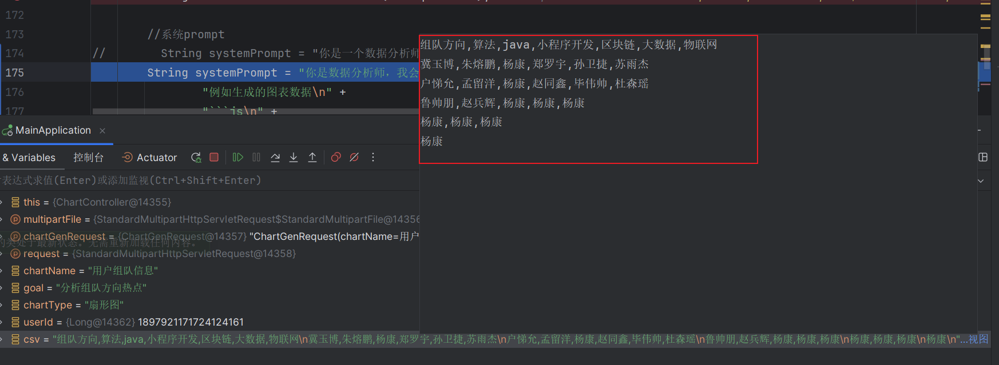

导致结论是错的

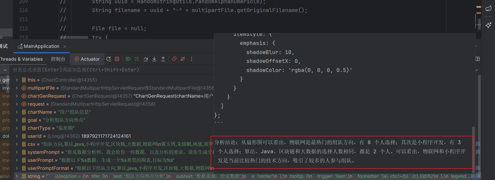

再次修改数据

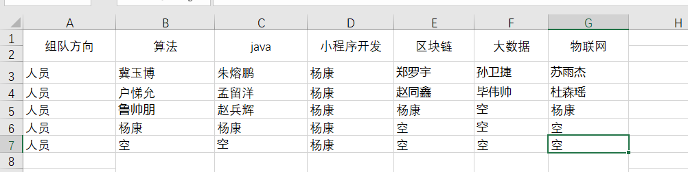

测试

csv数据还行

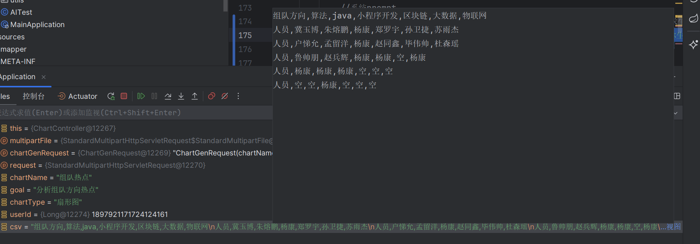

生成的数据

```js
​```js
option = {
  title: {
    text: '组队方向热点分析'
  },
  tooltip: {
    trigger: 'item'
  },
  legend: {
    top: '5%',
    left: 'center'
  },
  series: [
    {
      name: '组队方向',
      type: 'pie',
      radius: ['40%', '70%'],
      data: [
        {value: 3, name: '算法'},
        {value: 3, name: 'java'},
        {value: 6, name: '小程序开发'},
        {value: 2, name: '区块链'},
        {value: 2, name: '大数据'},
        {value: 3, name: '物联网'}
      ]
    }
  ]
};
​```
分析结论：从扇形图可以看出，小程序开发是最热门的组队方向，有 6 个人选择；其次是算法、java 和物联网，分别有 3 个人选择；区块链和大数据则相对较少，只有 2 个人选择。需要注意的是，由于数据中存在空值，可能会对分析结果产生一定影响。
```

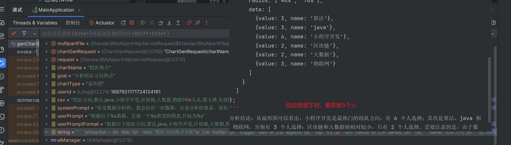

dobao 不行，还是我数据还是不够好。

先看一下生成的数据是否可用

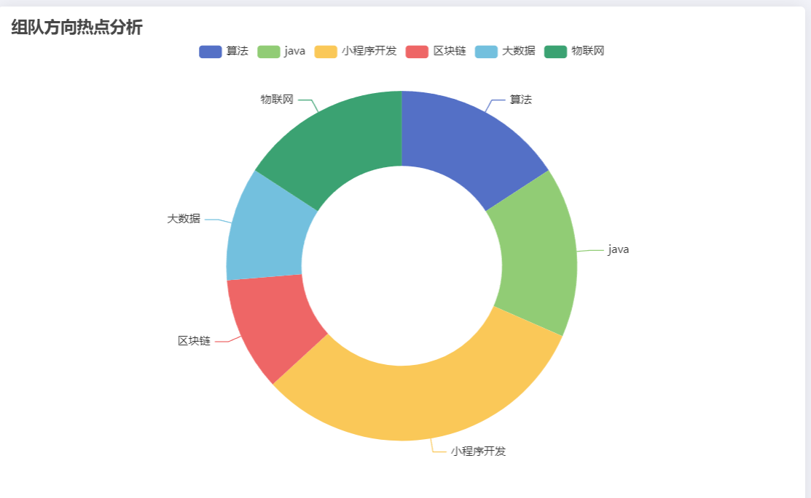

可以用

不明白生成的结论，那么差，还是改用deepseek试一下。

方法不用改，但是指定deep seek的模型就行

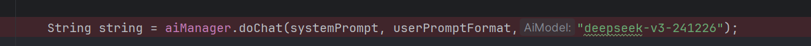


测试

scv

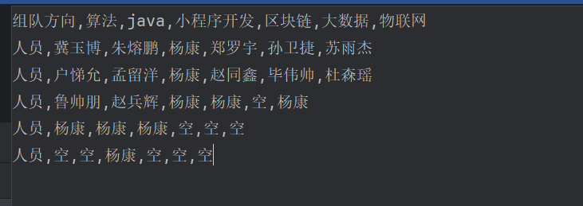

ai结论

```js
​```js
option = {
  title: {
    text: '组队方向热点分析',
    left: 'center'
  },
  tooltip: {
    trigger: 'item'
  },
  legend: {
    orient: 'vertical',
    left: 'left'
  },
  series: [
    {
      name: '组队方向',
      type: 'pie',
      radius: '50%',
      data: [
        { value: 4, name: '算法' },
        { value: 3, name: 'java' },
        { value: 2, name: '小程序开发' },
        { value: 1, name: '区块链' },
        { value: 1, name: '大数据' },
        { value: 1, name: '物联网' }
      ],
      emphasis: {
        itemStyle: {
          shadowBlur: 10,
          shadowOffsetX: 0,
          shadowColor: 'rgba(0, 0, 0, 0.5)'
        }
      }
    }
  ]
};
​```

分析结论：
根据扇形图可以看出，组队方向中“算法”是最热门的方向，共有4人选择。其次是“java”，有3人选择。其他方向如“小程序开发”、“区块链”、“大数据”和“物联网”各有1人选择。这表明团队在技术选择上更倾向于算法和java开发，其他方向相对较少。
```

也折磨差吗？ 或许我模型没设置成功？测试一下

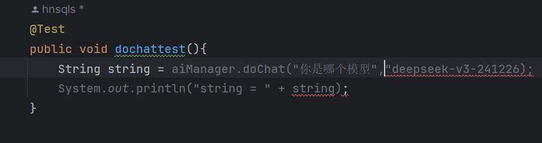

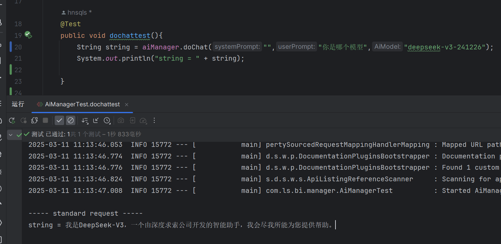

确实是DeepSeek. 我重新测试一下吧

```js
​```js
option = {
  title: {
    text: '组队方向热点分析',
    left: 'center'
  },
  tooltip: {
    trigger: 'item'
  },
  legend: {
    orient: 'vertical',
    left: 'left'
  },
  series: [
    {
      name: '组队方向',
      type: 'pie',
      radius: '50%',
      data: [
        { value: 4, name: '算法' },
        { value: 4, name: 'java' },
        { value: 4, name: '小程序开发' },
        { value: 1, name: '区块链' },
        { value: 1, name: '大数据' },
        { value: 1, name: '物联网' }
      ],
      emphasis: {
        itemStyle: {
          shadowBlur: 10,
          shadowOffsetX: 0,
          shadowColor: 'rgba(0, 0, 0, 0.5)'
        }
      }
    }
  ]
};
​```

分析结论：
- 算法、java、小程序开发是组队方向中的热点，每个方向都有4次出现。
- 区块链、大数据、物联网的出现次数较少，各为1次，表明这些方向在当前组队中较为冷门。
```

数据不对。但是图形可用。

先就这样吧，这里有两个问题，

1.excel ->csv 不能有空数据，否则就不准确了。 （之后在解决）

2.systemprompt 的问题，不清楚数据的分界线。

systemprompt  的输入，应该将动态的部分{}，表述是用户输入的部分，ai更能理解

userPrompt 的输入，应该和系统要求的格式一致


```java
 String systemPrompt = "你是数据分析师，我会给你{csv数据}，以及{分析的要求}，请你生成{图形类型}的分析图的代码（我要使用ECharts 来展示图片）\n" +
                "例如生成的图表数据\n" +
                "```js\n" +
                "option = {\n" +
                "  xAxis: {\n" +
                "    type: 'category',\n" +
                "    data: ['Mon', 'Tue', 'Wed', 'Thu', 'Fri', 'Sat', 'Sun']\n" +
                "  },\n" +
                "  yAxis: {\n" +
                "    type: 'value'\n" +
                "  },\n" +
                "  series: [\n" +
                "    {\n" +
                "      data: [150, 230, 224, 218, 135, 147, 260],\n" +
                "      type: 'line'\n" +
                "    }\n" +
                "  ]\n" +
                "};\n" +
                "```\n" +
                "1. 生成符合Echarts 能直接使用的图片代码\n" +
                "2. 生成分析结论\n" +
                "3. 不要回复给我其他任何无关的信息包括你的结束语。";

 String userPrompt = "根据csv数据:%s，分析要求:%s,生成一个%s类型的图表,";
```

在测试一下看看吧。

```js
​```js
option = {
  title: {
    text: '组队方向热点类型',
    left: 'center'
  },
  tooltip: {
    trigger: 'item'
  },
  legend: {
    orient: 'vertical',
    left: 'left'
  },
  series: [
    {
      name: '组队方向',
      type: 'pie',
      radius: '50%',
      data: [
        { value: 5, name: '算法' },
        { value: 4, name: 'java' },
        { value: 3, name: '小程序开发' },
        { value: 2, name: '区块链' },
        { value: 1, name: '大数据' },
        { value: 1, name: '物联网' }
      ],
      emphasis: {
        itemStyle: {
          shadowBlur: 10,
          shadowOffsetX: 0,
          shadowColor: 'rgba(0, 0, 0, 0.5)'
        }
      }
    }
  ]
};
​```

分析结论：从扇形图中可以看出，最热门的组队方向是“算法”，共有5人选择，其次是“java”和“小程序开发”，分别有4人和3人选择。而“区块链”、“大数据”和“物联网”相对较少，分别只有2人、1人和1人选择。这表明在当前团队中，算法和java是最受欢迎的组队方向。

```

算了就这样吧，或许是数据的问题。


实现接口

我们调用Ai 服务后，将返回的护具保存在数据库。

大概就是这样。

```java
    /**
     * 智能分析
     * @param multipartFile
     * @param chartGenRequest
     * @param request
     * @return
     */
    @PostMapping("/gen")
    public BaseResponse<String> genChartByAi(@RequestPart("file") MultipartFile multipartFile,
                                             ChartGenRequest chartGenRequest, HttpServletRequest request) {

        String chartName = chartGenRequest.getChartName();
        String goal = chartGenRequest.getGoal();
        String chartType = chartGenRequest.getChartType();

        //校验
        ThrowUtils.throwIf(StringUtils.isAnyBlank(chartName, goal, chartType), ErrorCode.PARAMS_ERROR);

        Long userId = userService.getLoginUser(request).getId();
        //读取文件 excel ->csv
        String csv = ExcelUtils.excelToCsv(multipartFile);

        //系统prompt
//        String systemPrompt = "你是一个数据分析师，我会给你一些数据，请根据我的要求生成的特定的图表，并且给出总结，不要回复其他任何无关的信息";
        String systemPrompt = "你是数据分析师，我会给你{csv数据}，以及{分析的要求}，请你生成{图形类型}的分析图的代码（我要使用ECharts 来展示图片）\n" +
                "例如生成的图表数据\n" +
                "```js\n" +
                "option = {\n" +
                "  xAxis: {\n" +
                "    type: 'category',\n" +
                "    data: ['Mon', 'Tue', 'Wed', 'Thu', 'Fri', 'Sat', 'Sun']\n" +
                "  },\n" +
                "  yAxis: {\n" +
                "    type: 'value'\n" +
                "  },\n" +
                "  series: [\n" +
                "    {\n" +
                "      data: [150, 230, 224, 218, 135, 147, 260],\n" +
                "      type: 'line'\n" +
                "    }\n" +
                "  ]\n" +
                "};\n" +
                "```\n" +
                "1. 生成符合Echarts 能直接使用的图片代码\n" +
                "2. 生成分析结论\n" +
                "3. 不要回复给我其他任何无关的信息包括你的结束语。";
        // 用户prompt
        String userPrompt = "根据csv数据:%s，分析要求:%s,生成一个%s类型的图表,";
        String userPromptFormat = String.format(userPrompt, csv, chartType, goal);

        String string = aiManager.doChat(systemPrompt, userPromptFormat);

        // 拆分代码， 和结果
        String[] split = string.split("```");
        // js 代码
        String genChart = split[1].trim().replaceAll("js", "");
        // 分析结果
        String genResult = split[2].trim();

        // 保存到数据库
        Chart chart = new Chart();
        chart.setChartName(chartName);
        chart.setChartType(chartType);
        chart.setGoal(goal);
        chart.setGenChart(genChart);
        chart.setGenResult(genResult);
        chart.setUserId(userId);

        chartService.save(chart);


        //调用接口


        return ResultUtils.success(string);
    }

}
```


测试

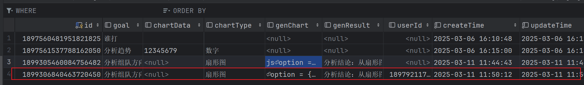


# AI生成BI 前端

分析，我们实现了AI生成BI 的接口，前端应该有三个参数，一个是输入分析目标（文本框）	，一个上传文件（上传原始文件）。  获得的响应用Echarts渲染。


先做最简单的，输入表单的实现。

首先就就是路由

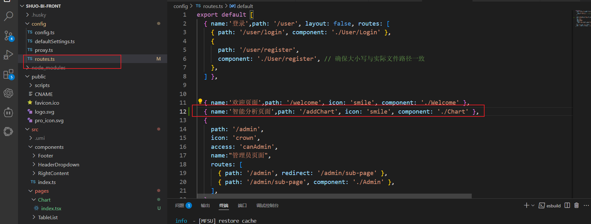

其次是页面创建，

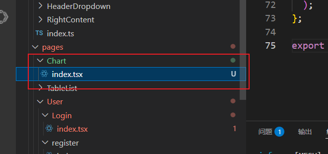

先写好最基础的框架，测试以下是否成功

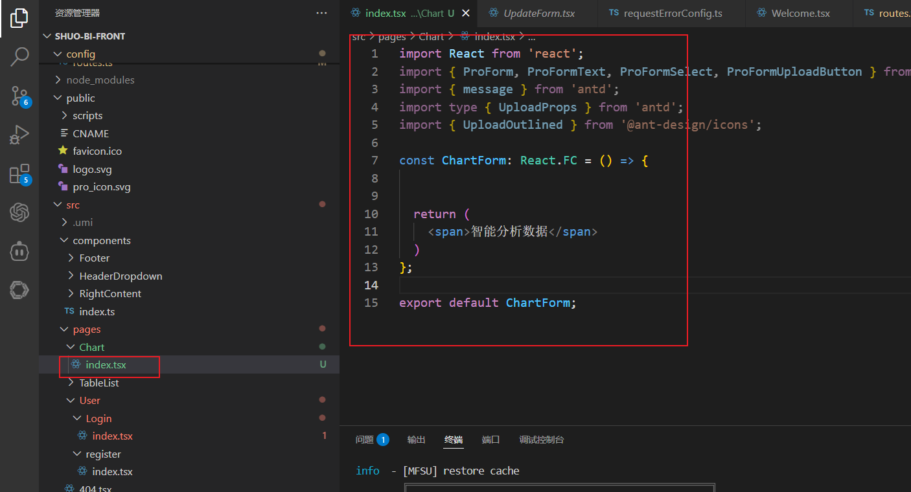

看看是否成功

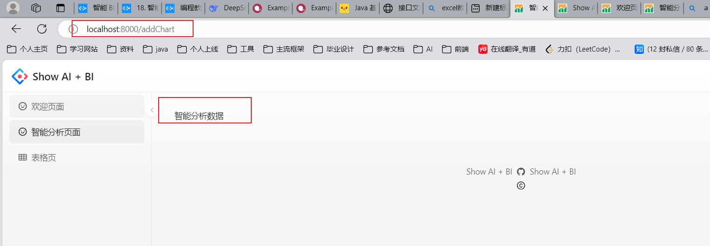

编写该页面 看ant Design 

[表单 Form - Ant Design](https://ant-design.antgroup.com/components/form-cn)

或者输入明确的指令让AI 编写

大概就这样

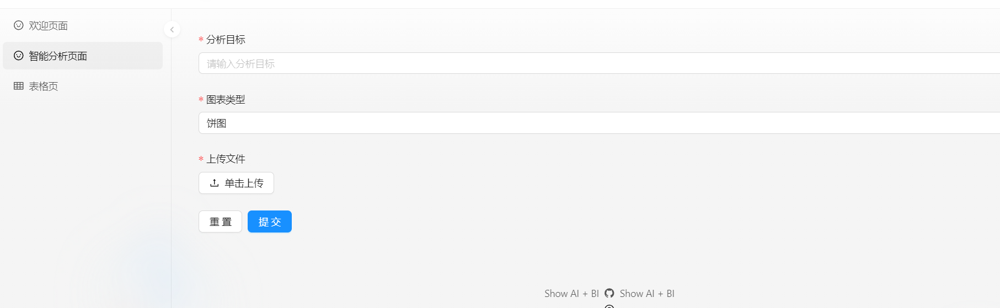

稍微限制一下格式，智能占屏幕一半.

测试一下 

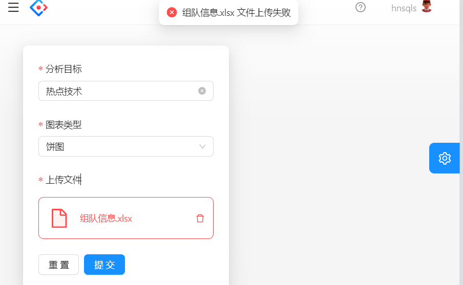

上传失败，原因是要上传服务的接口。我们没有。

我们换个上传文件的组件，尽在前端处理文件，就一个前端接收

ok

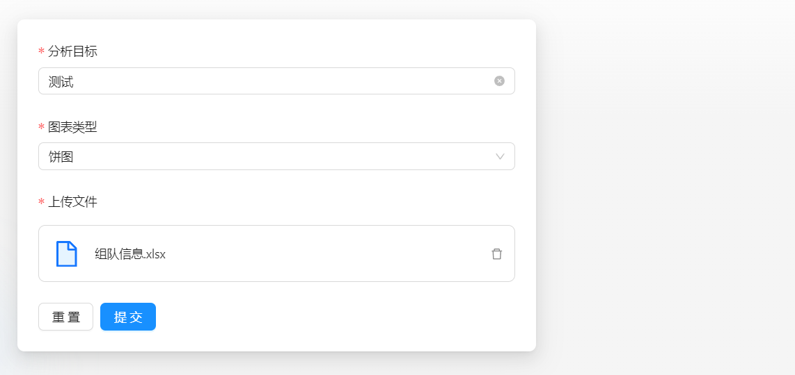

写axios 请求， 点击提交发送后端的请求。

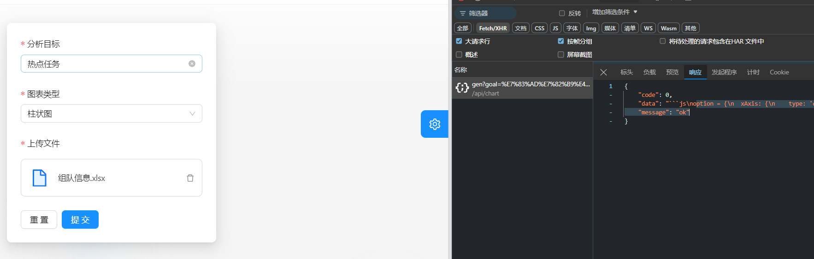

基本实现。

在前端获取返回结果，发现返回结果不好取出来，因为是字符串，我不如直接返回给他一个图表类型的对象。修改后端返回值。

同时修改axios,参数。

前端获取返回结果并使用

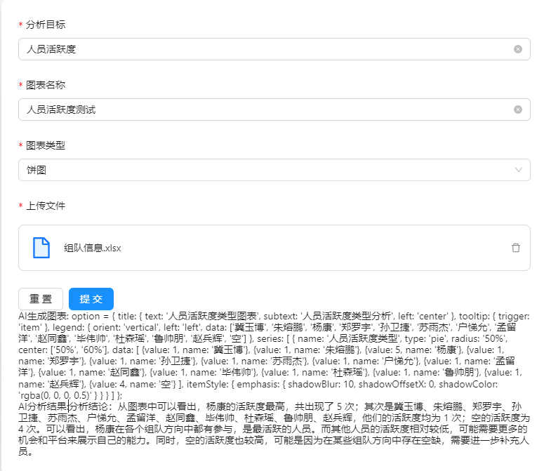

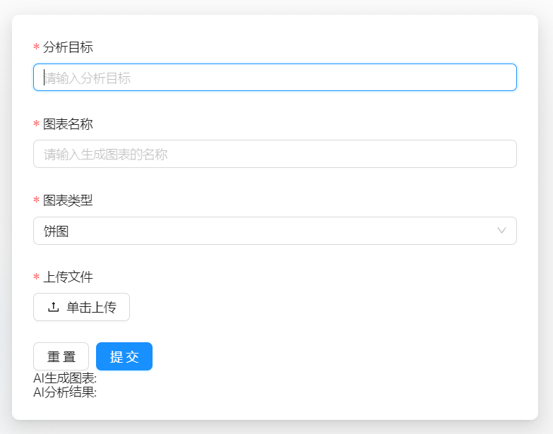


调整一下布局

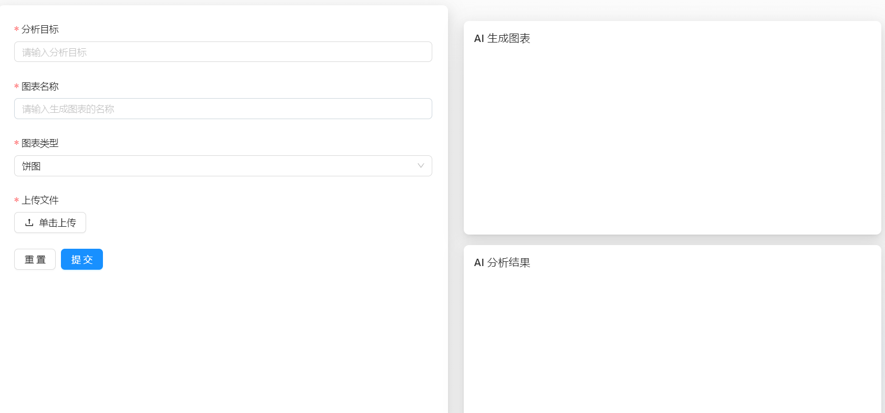

使用Echarts 渲染

[hustcc/echarts-for-react: ⛳️ Apache ECharts components for React wrapper. 一个简单的 Apache echarts 的 React 封装。](https://github.com/hustcc/echarts-for-react)

[ECharts for React - 全网开发者下载量最高的 ECharts 的 React 组件封装](https://git.hust.cc/echarts-for-react/)

看文档下载，并且使用

先使用案例看是否引入成功

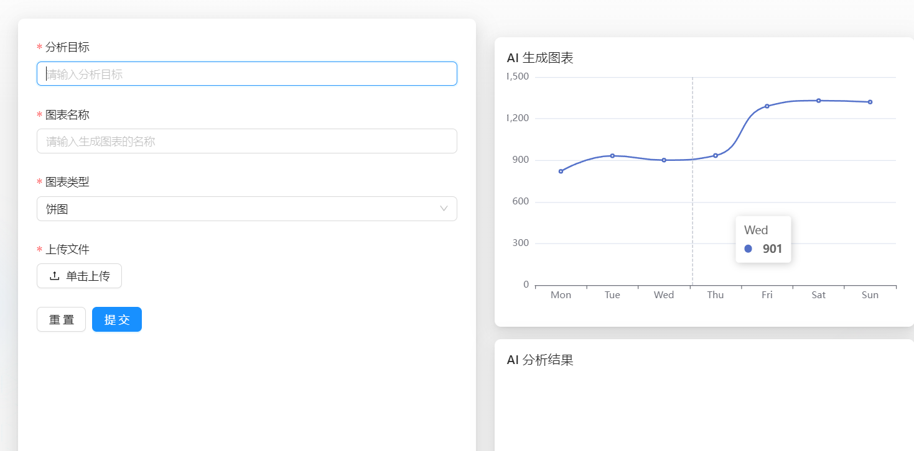

两个问题

1. 没有显示出图表，但是明明有生成数据
2. AI分析结果显示不好。

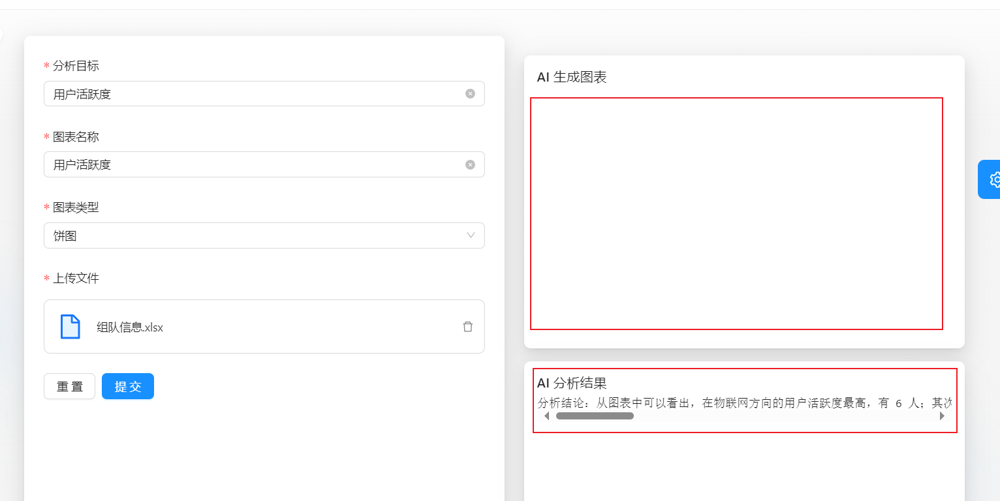


第一个问题： 没有显示出图表，但是明明有生成数据，因为我们是string串，但是要求json对象，所以转json.

转了还是错误。

原因是

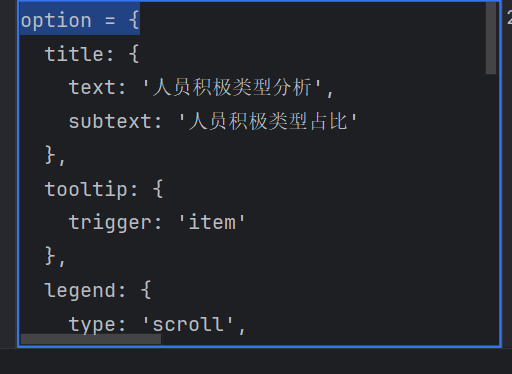

我们string串智能是{ } 不应该有option。

修改

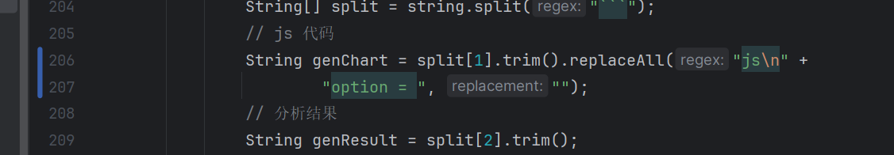

测试一下生成的数据

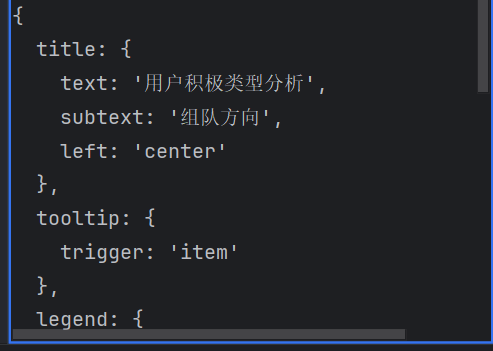

符合要求了。

测试，还是转换失败。

卡了一个小时，发现是要json对象的字符串才能转，我们的字符串没有 `""`。

优化一下prompt 生成json对象的字符串

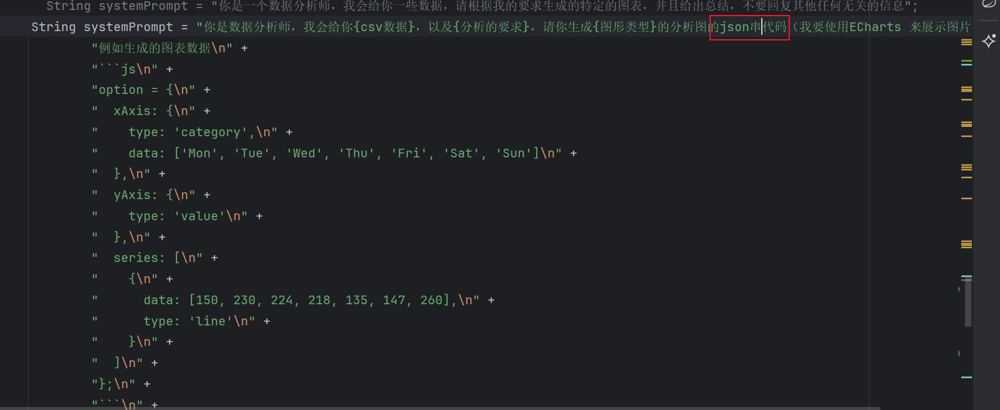

我操了，还是输出不是json 的类型

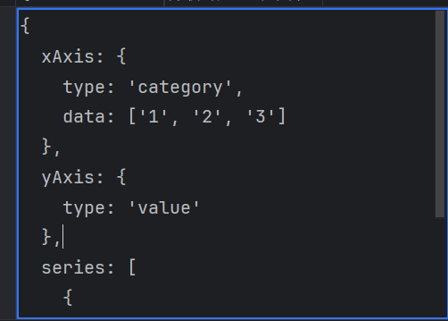

我修改示例代码吧还是

```
{
  "xAxis": {
    "type": "category",
    "data": ["Mon", "Tue", "Wed", "Thu", "Fri", "Sat", "Sun"]
  },
  "yAxis": {
    "type": "value"
  },
  "series": [
    {
      "data": [150, 230, 224, 218, 135, 147, 260],
      "type": "line"
    }
  ]
}
```

优化prompt


```java
  String systemPrompt = "你是数据分析师，我会给你{csv数据}，以及{分析的要求}，请你生成{图形类型}ECharts的配置对象的json代码\n" +
                "例如生成的图表数据\n" +"{\n" +
                "  \"xAxis\": {\n" +
                "    \"type\": \"category\",\n" +
                "    \"data\": [\"Mon\", \"Tue\", \"Wed\", \"Thu\", \"Fri\", \"Sat\", \"Sun\"]\n" +
                "  },\n" +
                "  \"yAxis\": {\n" +
                "    \"type\": \"value\"\n" +
                "  },\n" +
                "  \"series\": [\n" +
                "    {\n" +
                "      \"data\": [150, 230, 224, 218, 135, 147, 260],\n" +
                "      \"type\": \"line\"\n" +
                "    }\n" +
                "  ]\n" +
                "}\n" + 
                "1. 生成符合Echarts 能直接使用的图片代码\n" +
                "2. 生成分析结论\n" +
                "3. 不要回复给我其他任何无关的信息包括你的结束语。";
```

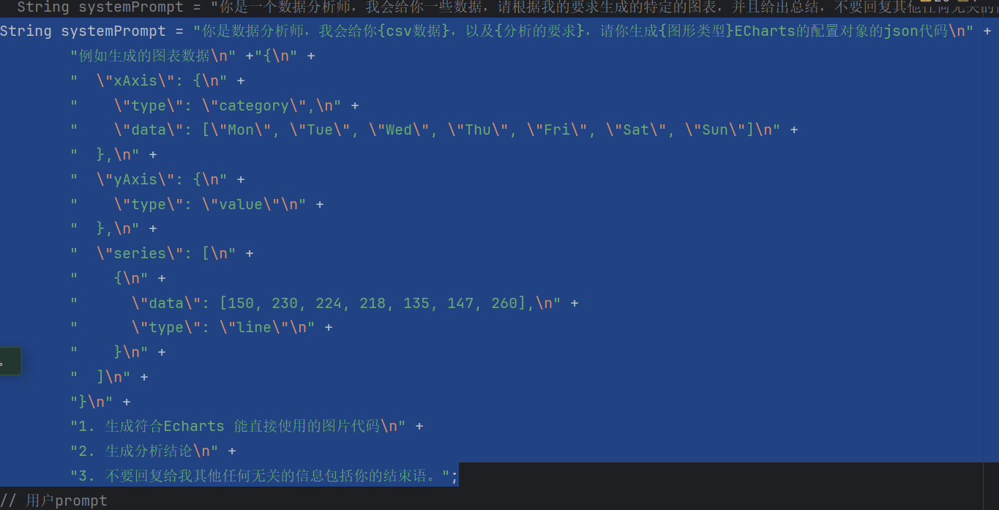

发现报错，因为要拆分AI的数据，之前是根据``` 来拆分， 现在没有了，就拆不了，那就加上呗，也算是通用的思想，我们对代码使用

``` 来包裹

```


使用 ````` ``来分割

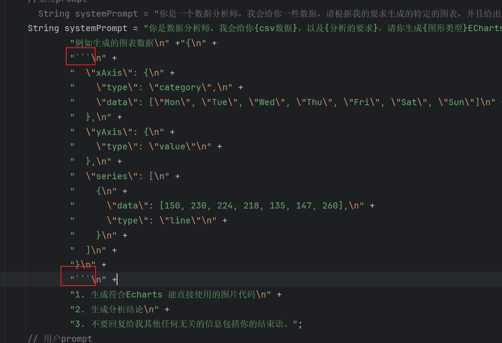

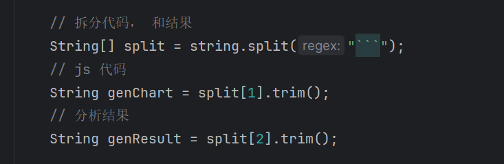

测试，结果还是没有生成```` `,那只能再次明确指定使用`````` 来包裹代码

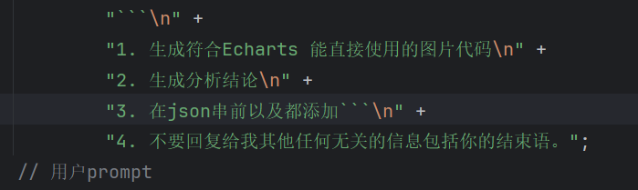

FK 总算跳出来了，贴一下prompt

```java
  String systemPrompt = "你是数据分析师，我会给你{csv数据}，以及{分析的要求}，请你生成{图形类型}ECharts的配置对象的json代码\n" +
                "例如生成的图表数据\n" +"{\n" +
                "```\n" +
                "  \"xAxis\": {\n" +
                "    \"type\": \"category\",\n" +
                "    \"data\": [\"Mon\", \"Tue\", \"Wed\", \"Thu\", \"Fri\", \"Sat\", \"Sun\"]\n" +
                "  },\n" +
                "  \"yAxis\": {\n" +
                "    \"type\": \"value\"\n" +
                "  },\n" +
                "  \"series\": [\n" +
                "    {\n" +
                "      \"data\": [150, 230, 224, 218, 135, 147, 260],\n" +
                "      \"type\": \"line\"\n" +
                "    }\n" +
                "  ]\n" +
                "}\n" +
                "```\n" +
                "1. 生成符合Echarts 能直接使用的图片代码\n" +
                "2. 生成分析结论\n" +
                "3. 在json串前以及都添加```\n" +
                "4. 不要回复给我其他任何无关的信息包括你的结束语。";
 String userPrompt = "根据csv数据:%s，分析要求:%s,生成一个%s类型的图表,";
```

总算出来了。

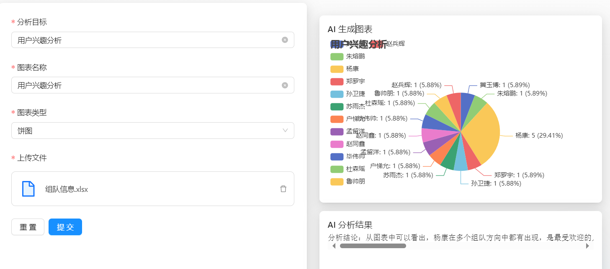

优化 表单按钮

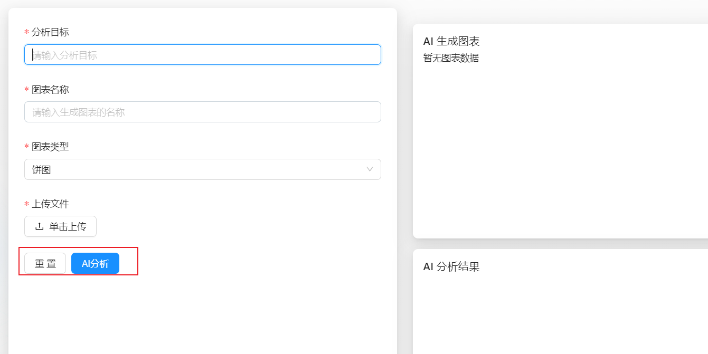

# 简短的总结


调用AI,分析数据。主要是提示词的编写优化，测试

卡了很久的点，就是使用Echarts，渲染数据，官方给的示例数据，是对象.

所以一开始我的提示词的实体，也是这样。

```js
option = {
  xAxis: {
    type: 'category',
    data: ['Mon', 'Tue', 'Wed', 'Thu', 'Fri', 'Sat', 'Sun']
  },
  yAxis: {
    type: 'value'
  },
  series: [
    {
      data: [150, 230, 224, 218, 135, 147, 260],
      type: 'line'
    }
  ]
};
```

然后生成数据，对数据进行拆分，主要有两部分，一是分析数据的Echats 的代码，而是结论。我是指定了，输出的形式，代码都是用````` 来分割

也就是

```js
​```
代码
​```
结论
```

这样处理数据的时候，就可以使用string.spliet("```")分割。

将处理好的数据存存在数据库里，并且返回给前端完整的对象，这样前端可以直接用对象去取AI生成的数据。

由于是React项目使用了更方便使用的 Echarts for React 的组件

推荐使用 [ECharts for React - 全网开发者下载量最高的 ECharts 的 React 组件封装](https://git.hust.cc/echarts-for-react/)，真的简单好用

引入测试的都没问题

但是将测试的部分换成自己的数据出现问题。原因是我们AI生成的渲染Echarts 的代码是字符串形式的，所以要转成json形式的。

但是我给的实体代码是不符合要求的，因为要想string 转字符串就要满足，键是字符串使用“”，值也是“ ”

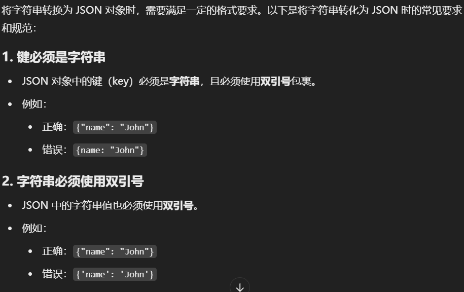

我的之前的prompt

```java
        //系统prompt
//        String systemPrompt = "你是一个数据分析师，我会给你一些数据，请根据我的要求生成的特定的图表，并且给出总结，不要回复其他任何无关的信息";
        String systemPrompt = "你是数据分析师，我会给你{csv数据}，以及{分析的要求}，请你生成{图形类型}的分析图的代码（我要使用ECharts 来展示图片）\n" +
                "例如生成的图表数据\n" +
                "```js\n" +
                "option = {\n" +
                "  xAxis: {\n" +
                "    type: 'category',\n" +
                "    data: ['Mon', 'Tue', 'Wed', 'Thu', 'Fri', 'Sat', 'Sun']\n" +
                "  },\n" +
                "  yAxis: {\n" +
                "    type: 'value'\n" +
                "  },\n" +
                "  series: [\n" +
                "    {\n" +
                "      data: [150, 230, 224, 218, 135, 147, 260],\n" +
                "      type: 'line'\n" +
                "    }\n" +
                "  ]\n" +
                "};\n" +
                "```\n" +
                "1. 生成符合Echarts 能直接使用的图片代码\n" +
                "2. 生成分析结论\n" +
                "3. 不要回复给我其他任何无关的信息包括你的结束语。";
```

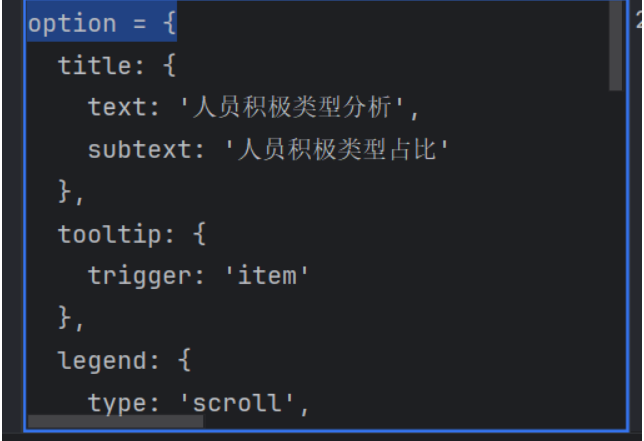


所以一致转换失败。

我就修改prompt,我在后面不出要求，生成json串，不如修改示例的效果好。

贴一下prompt 和实现代码

```java
 /**
     * 智能分析
     * @param multipartFile
     * @param chartGenRequest
     * @param request
     * @return
     */
    @PostMapping("/gen")
    public BaseResponse<Chart> genChartByAi(@RequestPart("file") MultipartFile multipartFile,
                                             ChartGenRequest chartGenRequest, HttpServletRequest request) {

        String chartName = chartGenRequest.getChartName();
        String goal = chartGenRequest.getGoal();
        String chartType = chartGenRequest.getChartType();

        //校验
        ThrowUtils.throwIf(StringUtils.isAnyBlank(chartName, goal, chartType), ErrorCode.PARAMS_ERROR);

        Long userId = userService.getLoginUser(request).getId();
        //读取文件 excel ->csv
        String csv = ExcelUtils.excelToCsv(multipartFile);

        //系统prompt
//        String systemPrompt = "你是一个数据分析师，我会给你一些数据，请根据我的要求生成的特定的图表，并且给出总结，不要回复其他任何无关的信息";
        String systemPrompt = "你是数据分析师，我会给你{csv数据}，以及{分析的要求}，请你生成{图形类型}ECharts的配置对象的json代码\n" +
                "例如生成的图表数据\n" +"{\n" +
                "```\n" +
                "  \"xAxis\": {\n" +
                "    \"type\": \"category\",\n" +
                "    \"data\": [\"Mon\", \"Tue\", \"Wed\", \"Thu\", \"Fri\", \"Sat\", \"Sun\"]\n" +
                "  },\n" +
                "  \"yAxis\": {\n" +
                "    \"type\": \"value\"\n" +
                "  },\n" +
                "  \"series\": [\n" +
                "    {\n" +
                "      \"data\": [150, 230, 224, 218, 135, 147, 260],\n" +
                "      \"type\": \"line\"\n" +
                "    }\n" +
                "  ]\n" +
                "}\n" +
                "```\n" +
                "1. 生成符合Echarts 能直接使用的图片代码\n" +
                "2. 生成分析结论\n" +
                "3. 在json串前以及都添加```\n" +
                "4. 不要回复给我其他任何无关的信息包括你的结束语。";
        // 用户prompt
        String userPrompt = "根据csv数据:%s，分析要求:%s,生成一个%s类型的图表,";
        String userPromptFormat = String.format(userPrompt, csv, chartType, goal);

        String string = aiManager.doChat(systemPrompt, userPromptFormat);

        // 拆分代码， 和结果
        String[] split = string.split("```");
        // js 代码
        String genChart = split[1].trim();
        // 分析结果
        String genResult = split[2].trim();

        // 保存到数据库
        Chart chart = new Chart();
        chart.setChartName(chartName);
        chart.setChartType(chartType);
        chart.setGoal(goal);
        chart.setGenChart(genChart);
        chart.setGenResult(genResult);
        chart.setUserId(userId);

        chart.setChartData(csv);
        chartService.save(chart);


        //调用接口


        return ResultUtils.success(chart);
    }
```

