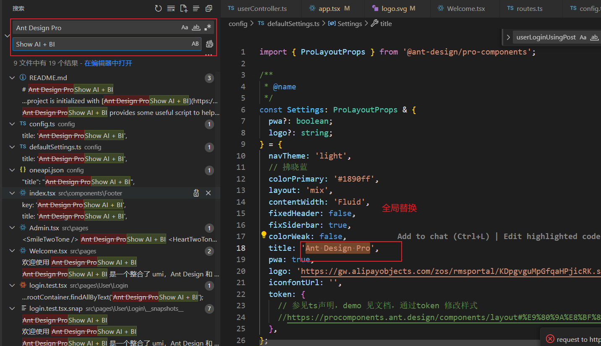
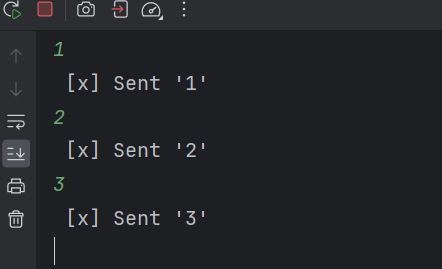
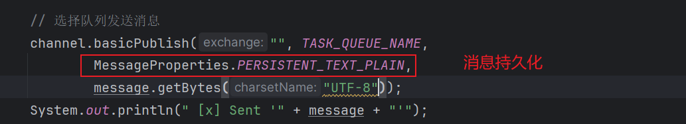
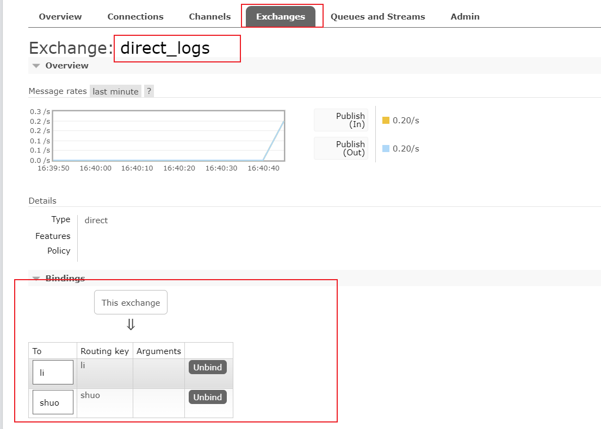

# shuo-BI

利用AI能力，用户输入想要处理数据以及如何处理生成报表。

# 需求分析

1. 智能分析：用户输入目标和原始数据(图标类型)，可以自动生成图标和分析结论
2. 图表管理(增删改查)
3. 图表生成的异步化(消息队列)
4. 对接 AI 能力

# 技术选型

后端

1. Spring Boot (万用 Java 后端项目模板，快速搭建基础框架，避免重复写代码)
2. MySQL数据库
3. MyBatis Plus数据访问框架
4. 消息队列(RabbitMQ)
5. AI 能力(Deepseek)
6. Excel 的上传和数据的解析(Easy Excel)
7. Swagger + Knife4j 项目接口文档
8. Hutool 工具库


前端

1. React
2. 开发框架 Umi + Ant Design Pro
3. 可视化开发库(Echarts + HighCharts + AntV) 
4. umi openapi 代码生成(自动生成后端调用代码) 


# 前端项目初始化

[文档总览 - Ant Design Pro](https://pro.ant.design/zh-CN/docs/overview)

根据文档创建，并运行测试


运行成功，

tips: 用npm run dev 启动是请求后端，现在我们还没写后端，可以使用start来启动，模拟数据启动


登入成功

移除不需要的部分


报错就github上搜。

移除国际化后


修改route.ts


移除国际化残留文件，


移除mock数据

删除测试文件


删除types


删除测试框架


替换logo： [iconfont-阿里巴巴矢量图标库](https://www.iconfont.cn/search/index)


替换左上角图表

png -> ico


全局替换title




# 库表设计

```sql
create  database  shuo_bi;

use shuo_bi;
-- 用户表
create table if not exists user
(
    id           bigint auto_increment comment 'id' primary key,
    userAccount  varchar(256)                           not null comment '账号',
    userPassword varchar(512)                           not null comment '密码',
    userName     varchar(256)                           null comment '用户昵称',
    userAvatar   varchar(1024)                          null comment '用户头像',
    userRole     varchar(256) default 'user'            not null comment '用户角色：user/admin',
    createTime   datetime     default CURRENT_TIMESTAMP not null comment '创建时间',
    updateTime   datetime     default CURRENT_TIMESTAMP not null on update CURRENT_TIMESTAMP comment '更新时间',
    isDelete     tinyint      default 0                 not null comment '是否删除',
    index idx_userAccount (userAccount)
) comment '用户' collate = utf8mb4_unicode_ci;


-- 图表信息表
create table if not exists chart
(
    id           bigint auto_increment comment 'id' primary key,
    goal				 text null comment'分析目标',
    chartData		 text null comment'图表数据',
    chartType		 varchar(128) null comment'图表类型',
    genChart		 text null comment'生成的图表数据',
    genResult		 text null comment'生成的分析结论',
    userId			 bigint null comment'创建用户 id',
    createTime   datetime     default CURRENT_TIMESTAMP not null comment '创建时间',
    updateTime   datetime     default CURRENT_TIMESTAMP not null on update CURRENT_TIMESTAMP comment '更新时间',
    isDelete     tinyint      default 0                 not null comment '是否删除'
) comment '图表信息表' collate = utf8mb4_unicode_ci;
```

# 前后端联调


前端根据后端接口自动生成axios请求


点击脚本 openapi


生成了axios.

测试一下


我们要修改request 的请求路径

src 下 app.tsx


地址对了


# 登录页面

点击登录，发送axios 请求，没啥。

需要注意的是表单的数据对应接口。


总结一下，表单参数名和前端请求的一致，通用的拦截器看看了解了解，获得当前用户信息的接口要改成自己的，拦截器携带seesionid。

# 注册页面

路由配置，


根据登录页面修改，主要修改请求axios，表单参数名称


# 登录注册bug修复

## 头像bug

一直 转圈，我要修改就先找该元素。


找到原因，解决


页面


退出登录


原因请求的接口不对， 改一下请求的接口，以及参数，（当然了openapi 可以自动生成，我们只需要修改）

解决


# AI生成BI 后端

用户输入 数据（excel），目标，生成的图表类型

后端接收文件，文件进行压缩，编写提示词给ai,生成数据。前端接收json数据渲染。

1. 用户输入

a. 分析目标

b. 上传原始数据(excel)

c. 更精细化地控制图表:比如图表类型、图表名称等

1. 后端校验

a. 校验用户的输入否合法(比如长度)

b. 成本控制(次数统计和校验、鉴权等)

1. 把处理后的数据输入给 AI 模型(调用 Al 接口，让 AI 模型给我们提供图表信息、结论文本
2. 图表信息(是一段 json 配置，是一段代码)、结论文本在前端进行展示


发现chart表不合理，添加chartName 字段


## 原生数据压缩

使用csv 压缩 excel 数据和提取

使用EazyExcel 读取excel文件。然后转成csv

引入依赖

```xml
    <!-- https://github.com/alibaba/easyexcel -->
        <dependency>
            <groupId>com.alibaba</groupId>
            <artifactId>easyexcel</artifactId>
            <version>3.1.1</version>
        </dependency>
```


编写工具类，用来读取excel并且转成csv

```java
/**
 * Excel 工具类
 */
@Slf4j
public class ExcelUtils {

    /**
     * excel 转csv
     * @param multiPartFile
     * @return
     */

    public  static String excelToCsv(MultipartFile multiPartFile){

//        File file = null;
//        try {
//             file = ResourceUtils.getFile("classpath:网站数据.xlsx");
//
//        }catch (Exception e){
//            e.printStackTrace();
//        }


        //读 excel
        List<Map<Integer,String>> list = null;
        try {
            list = EasyExcel.read(multiPartFile.getInputStream())
                    .excelType(ExcelTypeEnum.XLSX)
                    .sheet()
                    .headRowNumber(0)
                    .doReadSync();
        } catch (IOException e) {
            log.error("excel 转csv 失败",e);
            throw new RuntimeException(e);
        }


        //数据为 空
        if (list == null || list.size() == 0){
            return "";
        }

        //数据转csv
        StringBuilder stringBuilder = new StringBuilder();
        //表头
        LinkedHashMap<Integer, String> headerMap = (LinkedHashMap)list.get(0);
        List<String> headerList = headerMap.values().stream().filter(ObjectUtils::isNotEmpty).collect(Collectors.toList());
//        System.out.println(StringUtils.join(headerList,","));
        stringBuilder.append(StringUtils.join(headerList,",")).append("\n");

        //读取每一行
        for (int i = 1; i < list.size(); i++) {
            LinkedHashMap<Integer, String> dataMap = (LinkedHashMap)list.get(i);
            List<String> dateList = dataMap.values().stream().filter(ObjectUtils::isNotEmpty).collect(Collectors.toList());
//            System.out.println(StringUtils.join(dateList,","));
            stringBuilder.append(StringUtils.join(dateList,",")).append("\n");

        }

        return stringBuilder.toString();

    }

    public static void main(String[] args) {
        excelToCsv(null);
    }
}
```


## 调用AI

火山引擎

```xml
<!--        AI 接入 火山引擎 Deepseek https://www.volcengine.com/experience/ark-->
        <dependency>
            <groupId>com.volcengine</groupId>
            <artifactId>volcengine-java-sdk-ark-runtime</artifactId>
            <version>0.1.153</version>
        </dependency>
```

[火山方舟大模型体验中心-火山引擎](https://www.volcengine.com/experience/ark)

看示例的写法，最简单的直接就引入，然后测试是否能引入成功。

```java
package com.ls.bi;


import com.volcengine.ark.runtime.model.completion.chat.ChatCompletionRequest;
import com.volcengine.ark.runtime.model.completion.chat.ChatMessage;
import com.volcengine.ark.runtime.model.completion.chat.ChatMessageRole;
import com.volcengine.ark.runtime.service.ArkService;
import okhttp3.ConnectionPool;
import okhttp3.Dispatcher;

import java.util.ArrayList;
import java.util.List;
import java.util.concurrent.TimeUnit;

public class AITest {
    // 请确保您已将 API Key 存储在环境变量 ARK_API_KEY 中
// 初始化Ark客户端，从环境变量中读取您的API Key
        // 从环境变量中获取您的 API Key。此为默认方式，您可根据需要进行修改
//        static String apiKey = System.getenv("ARK_API_KEY");
        static String apiKey = "xxxxxxxxxxxx";


        // 此为默认路径，您可根据业务所在地域进行配置
        static String baseUrl = "https://ark.cn-beijing.volces.com/api/v3";
        static ConnectionPool connectionPool = new ConnectionPool(5, 1, TimeUnit.SECONDS);
        static Dispatcher dispatcher = new Dispatcher();
        static ArkService service = ArkService.builder().dispatcher(dispatcher).connectionPool(connectionPool).baseUrl(baseUrl).apiKey(apiKey).build();

        public static void main(String[] args) {
            System.out.println("\n----- standard request -----");
            // 构造消息
            final List<ChatMessage> messages = new ArrayList<>();
            final ChatMessage systemMessage = ChatMessage.builder().role(ChatMessageRole.SYSTEM).content("你是人工智能助手.").build();
            final ChatMessage userMessage = ChatMessage.builder().role(ChatMessageRole.USER).content("常见的十字花科植物有哪些？").build();
            messages.add(systemMessage);
            messages.add(userMessage);


            // 封装请求
            ChatCompletionRequest chatCompletionRequest = ChatCompletionRequest.builder()
                    // 指定您创建的方舟推理接入点 ID，此处已帮您修改为您的推理接入点 ID
                    .model("doubao-pro-32k-character-241215")
                    .messages(messages)
                    .build();

            // 发起请求获取结果
            service.createChatCompletion(chatCompletionRequest).getChoices().forEach(choice -> System.out.println(choice.getMessage().getContent()));

//            System.out.println("\n----- streaming request -----");
//            final List<ChatMessage> streamMessages = new ArrayList<>();
//            final ChatMessage streamSystemMessage = ChatMessage.builder().role(ChatMessageRole.SYSTEM).content("你是人工智能助手.").build();
//            final ChatMessage streamUserMessage = ChatMessage.builder().role(ChatMessageRole.USER).content("常见的十字花科植物有哪些？").build();
//            streamMessages.add(streamSystemMessage);
//            streamMessages.add(streamUserMessage);
//
//            ChatCompletionRequest streamChatCompletionRequest = ChatCompletionRequest.builder()
//                    // 指定您创建的方舟推理接入点 ID，此处已帮您修改为您的推理接入点 ID
//                    .model("doubao-pro-32k-character-241215")
//                    .messages(messages)
//                    .build();
//
//            service.streamChatCompletion(streamChatCompletionRequest)
//                    .doOnError(Throwable::printStackTrace)
//                    .blockingForEach(
//                            choice -> {
//                                if (choice.getChoices().size() > 0) {
//                                    System.out.print(choice.getChoices().get(0).getMessage().getContent());
//                                }
//                            }
//                    );

            service.shutdownExecutor();
        }

}


```

核心逻辑就是

1. 获取AIService

```java
       
 		static String apiKey = "xxxxxxxxxxxx";
		static String baseUrl = "https://ark.cn-beijing.volces.com/api/v3";
        static ConnectionPool connectionPool = new ConnectionPool(5, 1, TimeUnit.SECONDS);
        static Dispatcher dispatcher = new Dispatcher();
        static ArkService service = ArkService.builder().dispatcher(dispatcher).connectionPool(connectionPool).baseUrl(baseUrl).apiKey(apiKey).build();
```

2. 封装消息

主要是系统prompt 和用户prompt

```java
   final List<ChatMessage> messages = new ArrayList<>();
            final ChatMessage systemMessage = ChatMessage.builder().role(ChatMessageRole.SYSTEM).content("你是人工智能助手.").build();
            final ChatMessage userMessage = ChatMessage.builder().role(ChatMessageRole.USER).content("常见的十字花科植物有哪些？").build();
            messages.add(systemMessage);
            messages.add(userMessage);
```

3. 封装请求

指定模型，以及传入消息

```java
            ChatCompletionRequest chatCompletionRequest = ChatCompletionRequest.builder()
                    // 指定您创建的方舟推理接入点 ID，此处已帮您修改为您的推理接入点 ID
                    .model("doubao-pro-32k-character-241215")
                    .messages(messages)
                    .build();
```

4. 利用AIservice 发送消息,获得响应结果

```java
service.createChatCompletion(chatCompletionRequest).getChoices().forEach(choice -> System.out.println(choice.getMessage().getContent()));
```

调用成功


大题逻辑是上述那样， 我们可以稍微封装一下，以便使用.


先写一个AI的配置类，获取AI的请求服务。然后在编写工具类（传入消息，发送请求获取结果）。

编写 AIServiceConfig

主要是封装这部分

```java
 		static String apiKey = "xxxxxxxxxxxx";
		static String baseUrl = "https://ark.cn-beijing.volces.com/api/v3";
        static ConnectionPool connectionPool = new ConnectionPool(5, 1, TimeUnit.SECONDS);
        static Dispatcher dispatcher = new Dispatcher();
        static ArkService service = ArkService.builder().dispatcher(dispatcher).connectionPool(connectionPool).baseUrl(baseUrl).apiKey(apiKey).build();
```

```java
@Configuration
@ConfigurationProperties(prefix = "ai")
@Data
public class AIConfig {

    // apiKey 自动从配置文件获取 可以选择local.yaml
    private String apiKey;

    /**
     * AI 请求服务
     * @return
     */
    @Bean
    public ArkService AIService(){
        //
        ConnectionPool connectionPool = new ConnectionPool(5, 1, TimeUnit.SECONDS);
        Dispatcher dispatcher = new Dispatcher();
        ArkService service = ArkService.builder()
                .dispatcher(dispatcher)
                .connectionPool(connectionPool)
                .baseUrl("https://ark.cn-beijing.volces.com/api/v3")
                .apiKey(apiKey).build();

        return service;
    }

}

```

记得配置类中编写apikey,在新建一个配置文件，applicaiton-local.yaml，忽略提交


编写工具类，方便使用

```java
package com.ls.bi.manager;

import com.ls.bi.common.ErrorCode;
import com.ls.bi.config.AiConfig;
import com.ls.bi.exception.BusinessException;
import com.volcengine.ark.runtime.model.completion.chat.ChatCompletionChoice;
import com.volcengine.ark.runtime.model.completion.chat.ChatCompletionRequest;
import com.volcengine.ark.runtime.model.completion.chat.ChatMessage;
import com.volcengine.ark.runtime.model.completion.chat.ChatMessageRole;
import com.volcengine.ark.runtime.service.ArkService;
import org.springframework.stereotype.Component;

import javax.annotation.Resource;
import java.util.ArrayList;
import java.util.List;

@Component
public class AiManager {


    /**
     * AI 服务
     */
    @Resource
    private ArkService AIService;


    /**
     * AI 默认模型 doubao
     */
    private final String Default_Model= "doubao-pro-32k-character-241215";


    /**
     * AI工具请求
     * @param systemPrompt
     * @param userPrompt
     * @return
     */
    public String doChat(String systemPrompt, String userPrompt){


        System.out.println("\n----- standard request -----");
        // 构造消息
        final List<ChatMessage> messages = new ArrayList<>();
        final ChatMessage systemMessage = ChatMessage.builder().role(ChatMessageRole.SYSTEM).content(systemPrompt).build();
        final ChatMessage userMessage = ChatMessage.builder().role(ChatMessageRole.USER).content(userPrompt).build();
        messages.add(systemMessage);
        messages.add(userMessage);


        // 封装请求
        ChatCompletionRequest chatCompletionRequest = ChatCompletionRequest.builder()
                // 指定您创建的方舟推理接入点 ID，此处已帮您修改为您的推理接入点 ID
                .model(Default_Model)
                .messages(messages)
                .build();


        // 发起请求获取结果
        List<ChatCompletionChoice> choices = AIService.createChatCompletion(chatCompletionRequest).getChoices();

        if (choices == null || choices.isEmpty()) {
            throw  new BusinessException(ErrorCode.OPERATION_ERROR,"AI生成失败");
        }

        StringBuilder stringBuilder = new StringBuilder();
        choices.forEach(choice -> stringBuilder.append(choice.getMessage().getContent()).append("\n"));

        return stringBuilder.toString();

    }


    /**
     * AI工具请求
     * @param systemPrompt
     * @param userPrompt
     * @param AiModel
     * @return
     */
    public String doChat(String systemPrompt, String userPrompt,String AiModel){


        System.out.println("\n----- standard request -----");
        // 构造消息
        final List<ChatMessage> messages = new ArrayList<>();
        final ChatMessage systemMessage = ChatMessage.builder().role(ChatMessageRole.SYSTEM).content(systemPrompt).build();
        final ChatMessage userMessage = ChatMessage.builder().role(ChatMessageRole.USER).content(userPrompt).build();
        messages.add(systemMessage);
        messages.add(userMessage);


        // 封装请求
        ChatCompletionRequest chatCompletionRequest = ChatCompletionRequest.builder()
                // 指定您创建的方舟推理接入点 ID，此处已帮您修改为您的推理接入点 ID
                .model(AiModel)
                .messages(messages)
                .build();

        // 发起请求获取结果
        List<ChatCompletionChoice> choices = AIService.createChatCompletion(chatCompletionRequest).getChoices();

        if (choices == null || choices.isEmpty()) {
            throw  new BusinessException(ErrorCode.OPERATION_ERROR,"AI生成失败");
        }

        // 解析结果
        StringBuilder stringBuilder = new StringBuilder();
        choices.forEach(choice -> stringBuilder.append(choice.getMessage().getContent()).append("\n"));

        return stringBuilder.toString();

    }


    /**
     * AI工具请求
     * @param userPrompt
     * @return
     */
    public String doChat(String userPrompt){


        System.out.println("\n----- standard request -----");
        // 构造消息
        final List<ChatMessage> messages = new ArrayList<>();
        final ChatMessage systemMessage = ChatMessage.builder().role(ChatMessageRole.SYSTEM).content("").build();
        final ChatMessage userMessage = ChatMessage.builder().role(ChatMessageRole.USER).content(userPrompt).build();
        messages.add(systemMessage);
        messages.add(userMessage);


        // 封装请求
        ChatCompletionRequest chatCompletionRequest = ChatCompletionRequest.builder()
                // 指定您创建的方舟推理接入点 ID，此处已帮您修改为您的推理接入点 ID
                .model("Default_Model")
                .messages(messages)
                .build();


        // 发起请求获取结果
        List<ChatCompletionChoice> choices = AIService.createChatCompletion(chatCompletionRequest).getChoices();

        if (choices == null || choices.isEmpty()) {
            throw  new BusinessException(ErrorCode.OPERATION_ERROR,"AI生成失败");
        }

        StringBuilder stringBuilder = new StringBuilder();
        choices.forEach(choice -> stringBuilder.append(choice.getMessage().getContent()).append("\n"));

        return stringBuilder.toString();

    }


}

```

apikey，写道其他的配置文件中，比如说application-yaml.中，忽略提交

在启动的时候，指定上启动使用的配置文件

```shell
--spring.profiles.active=local
```


## 如何让AI根据数据生成我们要求的分析图

直接不能生成图，或者说现有的aI 不能生成图的能力比较弱。

我们仅仅让AI根据数据，进行分析，生成分析数据的图表代码，利用前端的组件库(Echarts)将这些生成的代码在网页上展示

  [Echarts 支持在线调试](https://echarts.apache.org/examples/zh/editor.html?c=line-simple)。

 梳理一下，就是我们将数据给AI，让他分析数据生成图表的代码，我们根据图表代码，使用Echarts 库展示。

那就要编写prompt ,让AI生成符合要求的数据


简单的折现图趋势，就不贴图了， 测试ok


稍微复杂的就有一些问题

比如说excel,有空值，导致csv就错误


生成的数据，是可以展示的

基本可用吧


只是不太符合要求，数据给的不太行。


修改一下数据


再次测试

转cvs 的问题很大啊


导致结论是错的


再次修改数据


测试

csv数据还行


生成的数据

```js
​```js
option = {
  title: {
    text: '组队方向热点分析'
  },
  tooltip: {
    trigger: 'item'
  },
  legend: {
    top: '5%',
    left: 'center'
  },
  series: [
    {
      name: '组队方向',
      type: 'pie',
      radius: ['40%', '70%'],
      data: [
        {value: 3, name: '算法'},
        {value: 3, name: 'java'},
        {value: 6, name: '小程序开发'},
        {value: 2, name: '区块链'},
        {value: 2, name: '大数据'},
        {value: 3, name: '物联网'}
      ]
    }
  ]
};
​```
分析结论：从扇形图可以看出，小程序开发是最热门的组队方向，有 6 个人选择；其次是算法、java 和物联网，分别有 3 个人选择；区块链和大数据则相对较少，只有 2 个人选择。需要注意的是，由于数据中存在空值，可能会对分析结果产生一定影响。
```


dobao 不行，还是我数据还是不够好。

先看一下生成的数据是否可用


可以用

不明白生成的结论，那么差，还是改用deepseek试一下。

方法不用改，但是指定deep seek的模型就行


测试

scv


ai结论

```js
​```js
option = {
  title: {
    text: '组队方向热点分析',
    left: 'center'
  },
  tooltip: {
    trigger: 'item'
  },
  legend: {
    orient: 'vertical',
    left: 'left'
  },
  series: [
    {
      name: '组队方向',
      type: 'pie',
      radius: '50%',
      data: [
        { value: 4, name: '算法' },
        { value: 3, name: 'java' },
        { value: 2, name: '小程序开发' },
        { value: 1, name: '区块链' },
        { value: 1, name: '大数据' },
        { value: 1, name: '物联网' }
      ],
      emphasis: {
        itemStyle: {
          shadowBlur: 10,
          shadowOffsetX: 0,
          shadowColor: 'rgba(0, 0, 0, 0.5)'
        }
      }
    }
  ]
};
​```

分析结论：
根据扇形图可以看出，组队方向中“算法”是最热门的方向，共有4人选择。其次是“java”，有3人选择。其他方向如“小程序开发”、“区块链”、“大数据”和“物联网”各有1人选择。这表明团队在技术选择上更倾向于算法和java开发，其他方向相对较少。
```

也折磨差吗？ 或许我模型没设置成功？测试一下


确实是DeepSeek. 我重新测试一下吧

```js
​```js
option = {
  title: {
    text: '组队方向热点分析',
    left: 'center'
  },
  tooltip: {
    trigger: 'item'
  },
  legend: {
    orient: 'vertical',
    left: 'left'
  },
  series: [
    {
      name: '组队方向',
      type: 'pie',
      radius: '50%',
      data: [
        { value: 4, name: '算法' },
        { value: 4, name: 'java' },
        { value: 4, name: '小程序开发' },
        { value: 1, name: '区块链' },
        { value: 1, name: '大数据' },
        { value: 1, name: '物联网' }
      ],
      emphasis: {
        itemStyle: {
          shadowBlur: 10,
          shadowOffsetX: 0,
          shadowColor: 'rgba(0, 0, 0, 0.5)'
        }
      }
    }
  ]
};
​```

分析结论：
- 算法、java、小程序开发是组队方向中的热点，每个方向都有4次出现。
- 区块链、大数据、物联网的出现次数较少，各为1次，表明这些方向在当前组队中较为冷门。
```

数据不对。但是图形可用。

先就这样吧，这里有两个问题，

1.excel ->csv 不能有空数据，否则就不准确了。 （之后在解决）

2.systemprompt 的问题，不清楚数据的分界线。

systemprompt  的输入，应该将动态的部分{}，表述是用户输入的部分，ai更能理解

userPrompt 的输入，应该和系统要求的格式一致


```java
 String systemPrompt = "你是数据分析师，我会给你{csv数据}，以及{分析的要求}，请你生成{图形类型}的分析图的代码（我要使用ECharts 来展示图片）\n" +
                "例如生成的图表数据\n" +
                "```js\n" +
                "option = {\n" +
                "  xAxis: {\n" +
                "    type: 'category',\n" +
                "    data: ['Mon', 'Tue', 'Wed', 'Thu', 'Fri', 'Sat', 'Sun']\n" +
                "  },\n" +
                "  yAxis: {\n" +
                "    type: 'value'\n" +
                "  },\n" +
                "  series: [\n" +
                "    {\n" +
                "      data: [150, 230, 224, 218, 135, 147, 260],\n" +
                "      type: 'line'\n" +
                "    }\n" +
                "  ]\n" +
                "};\n" +
                "```\n" +
                "1. 生成符合Echarts 能直接使用的图片代码\n" +
                "2. 生成分析结论\n" +
                "3. 不要回复给我其他任何无关的信息包括你的结束语。";

 String userPrompt = "根据csv数据:%s，分析要求:%s,生成一个%s类型的图表,";
```

在测试一下看看吧。

```js
​```js
option = {
  title: {
    text: '组队方向热点类型',
    left: 'center'
  },
  tooltip: {
    trigger: 'item'
  },
  legend: {
    orient: 'vertical',
    left: 'left'
  },
  series: [
    {
      name: '组队方向',
      type: 'pie',
      radius: '50%',
      data: [
        { value: 5, name: '算法' },
        { value: 4, name: 'java' },
        { value: 3, name: '小程序开发' },
        { value: 2, name: '区块链' },
        { value: 1, name: '大数据' },
        { value: 1, name: '物联网' }
      ],
      emphasis: {
        itemStyle: {
          shadowBlur: 10,
          shadowOffsetX: 0,
          shadowColor: 'rgba(0, 0, 0, 0.5)'
        }
      }
    }
  ]
};
​```

分析结论：从扇形图中可以看出，最热门的组队方向是“算法”，共有5人选择，其次是“java”和“小程序开发”，分别有4人和3人选择。而“区块链”、“大数据”和“物联网”相对较少，分别只有2人、1人和1人选择。这表明在当前团队中，算法和java是最受欢迎的组队方向。

```

算了就这样吧，或许是数据的问题。


实现接口

我们调用Ai 服务后，将返回的护具保存在数据库。

大概就是这样。

```java
    /**
     * 智能分析
     * @param multipartFile
     * @param chartGenRequest
     * @param request
     * @return
     */
    @PostMapping("/gen")
    public BaseResponse<String> genChartByAi(@RequestPart("file") MultipartFile multipartFile,
                                             ChartGenRequest chartGenRequest, HttpServletRequest request) {

        String chartName = chartGenRequest.getChartName();
        String goal = chartGenRequest.getGoal();
        String chartType = chartGenRequest.getChartType();

        //校验
        ThrowUtils.throwIf(StringUtils.isAnyBlank(chartName, goal, chartType), ErrorCode.PARAMS_ERROR);

        Long userId = userService.getLoginUser(request).getId();
        //读取文件 excel ->csv
        String csv = ExcelUtils.excelToCsv(multipartFile);

        //系统prompt
//        String systemPrompt = "你是一个数据分析师，我会给你一些数据，请根据我的要求生成的特定的图表，并且给出总结，不要回复其他任何无关的信息";
        String systemPrompt = "你是数据分析师，我会给你{csv数据}，以及{分析的要求}，请你生成{图形类型}的分析图的代码（我要使用ECharts 来展示图片）\n" +
                "例如生成的图表数据\n" +
                "```js\n" +
                "option = {\n" +
                "  xAxis: {\n" +
                "    type: 'category',\n" +
                "    data: ['Mon', 'Tue', 'Wed', 'Thu', 'Fri', 'Sat', 'Sun']\n" +
                "  },\n" +
                "  yAxis: {\n" +
                "    type: 'value'\n" +
                "  },\n" +
                "  series: [\n" +
                "    {\n" +
                "      data: [150, 230, 224, 218, 135, 147, 260],\n" +
                "      type: 'line'\n" +
                "    }\n" +
                "  ]\n" +
                "};\n" +
                "```\n" +
                "1. 生成符合Echarts 能直接使用的图片代码\n" +
                "2. 生成分析结论\n" +
                "3. 不要回复给我其他任何无关的信息包括你的结束语。";
        // 用户prompt
        String userPrompt = "根据csv数据:%s，分析要求:%s,生成一个%s类型的图表,";
        String userPromptFormat = String.format(userPrompt, csv, chartType, goal);

        String string = aiManager.doChat(systemPrompt, userPromptFormat);

        // 拆分代码， 和结果
        String[] split = string.split("```");
        // js 代码
        String genChart = split[1].trim().replaceAll("js", "");
        // 分析结果
        String genResult = split[2].trim();

        // 保存到数据库
        Chart chart = new Chart();
        chart.setChartName(chartName);
        chart.setChartType(chartType);
        chart.setGoal(goal);
        chart.setGenChart(genChart);
        chart.setGenResult(genResult);
        chart.setUserId(userId);

        chartService.save(chart);


        //调用接口


        return ResultUtils.success(string);
    }

}
```


测试


# AI生成BI 前端

分析，我们实现了AI生成BI 的接口，前端应该有三个参数，一个是输入分析目标（文本框）	，一个上传文件（上传原始文件）。  获得的响应用Echarts渲染。


先做最简单的，输入表单的实现。

首先就就是路由


其次是页面创建，


先写好最基础的框架，测试以下是否成功


看看是否成功


编写该页面 看ant Design 

[表单 Form - Ant Design](https://ant-design.antgroup.com/components/form-cn)

或者输入明确的指令让AI 编写

大概就这样


稍微限制一下格式，智能占屏幕一半.

测试一下 


上传失败，原因是要上传服务的接口。我们没有。

我们换个上传文件的组件，尽在前端处理文件，就一个前端接收

ok


写axios 请求， 点击提交发送后端的请求。


基本实现。

在前端获取返回结果，发现返回结果不好取出来，因为是字符串，我不如直接返回给他一个图表类型的对象。修改后端返回值。

同时修改axios,参数。

前端获取返回结果并使用


调整一下布局


使用Echarts 渲染

[hustcc/echarts-for-react: ⛳️ Apache ECharts components for React wrapper. 一个简单的 Apache echarts 的 React 封装。](https://github.com/hustcc/echarts-for-react)

[ECharts for React - 全网开发者下载量最高的 ECharts 的 React 组件封装](https://git.hust.cc/echarts-for-react/)

看文档下载，并且使用

先使用案例看是否引入成功


两个问题

1. 没有显示出图表，但是明明有生成数据
2. AI分析结果显示不好。


第一个问题： 没有显示出图表，但是明明有生成数据，因为我们是string串，但是要求json对象，所以转json.

转了还是错误。

原因是


我们string串智能是{ } 不应该有option。

修改


测试一下生成的数据


符合要求了。

测试，还是转换失败。

卡了一个小时，发现是要json对象的字符串才能转，我们的字符串没有 `""`。

优化一下prompt 生成json对象的字符串


我操了，还是输出不是json 的类型


我修改示例代码吧还是

```
{
  "xAxis": {
    "type": "category",
    "data": ["Mon", "Tue", "Wed", "Thu", "Fri", "Sat", "Sun"]
  },
  "yAxis": {
    "type": "value"
  },
  "series": [
    {
      "data": [150, 230, 224, 218, 135, 147, 260],
      "type": "line"
    }
  ]
}
```

优化prompt


```java
  String systemPrompt = "你是数据分析师，我会给你{csv数据}，以及{分析的要求}，请你生成{图形类型}ECharts的配置对象的json代码\n" +
                "例如生成的图表数据\n" +"{\n" +
                "  \"xAxis\": {\n" +
                "    \"type\": \"category\",\n" +
                "    \"data\": [\"Mon\", \"Tue\", \"Wed\", \"Thu\", \"Fri\", \"Sat\", \"Sun\"]\n" +
                "  },\n" +
                "  \"yAxis\": {\n" +
                "    \"type\": \"value\"\n" +
                "  },\n" +
                "  \"series\": [\n" +
                "    {\n" +
                "      \"data\": [150, 230, 224, 218, 135, 147, 260],\n" +
                "      \"type\": \"line\"\n" +
                "    }\n" +
                "  ]\n" +
                "}\n" + 
                "1. 生成符合Echarts 能直接使用的图片代码\n" +
                "2. 生成分析结论\n" +
                "3. 不要回复给我其他任何无关的信息包括你的结束语。";
```


发现报错，因为要拆分AI的数据，之前是根据``` 来拆分， 现在没有了，就拆不了，那就加上呗，也算是通用的思想，我们对代码使用

``` 来包裹

```


使用 ````` ``来分割


测试，结果还是没有生成```` `,那只能再次明确指定使用`````` 来包裹代码


FK 总算跳出来了，贴一下prompt

```java
  String systemPrompt = "你是数据分析师，我会给你{csv数据}，以及{分析的要求}，请你生成{图形类型}ECharts的配置对象的json代码\n" +
                "例如生成的图表数据\n" +"{\n" +
                "```\n" +
                "  \"xAxis\": {\n" +
                "    \"type\": \"category\",\n" +
                "    \"data\": [\"Mon\", \"Tue\", \"Wed\", \"Thu\", \"Fri\", \"Sat\", \"Sun\"]\n" +
                "  },\n" +
                "  \"yAxis\": {\n" +
                "    \"type\": \"value\"\n" +
                "  },\n" +
                "  \"series\": [\n" +
                "    {\n" +
                "      \"data\": [150, 230, 224, 218, 135, 147, 260],\n" +
                "      \"type\": \"line\"\n" +
                "    }\n" +
                "  ]\n" +
                "}\n" +
                "```\n" +
                "1. 生成符合Echarts 能直接使用的图片代码\n" +
                "2. 生成分析结论\n" +
                "3. 在json串前以及都添加```\n" +
                "4. 不要回复给我其他任何无关的信息包括你的结束语。";
 String userPrompt = "根据csv数据:%s，分析要求:%s,生成一个%s类型的图表,";
```

总算出来了。


优化 表单按钮


# 简短的总结


调用AI,分析数据。主要是提示词的编写优化，测试

卡了很久的点，就是使用Echarts，渲染数据，官方给的示例数据，是对象.

所以一开始我的提示词的实体，也是这样。

```js
option = {
  xAxis: {
    type: 'category',
    data: ['Mon', 'Tue', 'Wed', 'Thu', 'Fri', 'Sat', 'Sun']
  },
  yAxis: {
    type: 'value'
  },
  series: [
    {
      data: [150, 230, 224, 218, 135, 147, 260],
      type: 'line'
    }
  ]
};
```

然后生成数据，对数据进行拆分，主要有两部分，一是分析数据的Echats 的代码，而是结论。我是指定了，输出的形式，代码都是用````` 来分割

也就是

```js
​```
代码
​```
结论
```

这样处理数据的时候，就可以使用string.spliet("```")分割。

将处理好的数据存存在数据库里，并且返回给前端完整的对象，这样前端可以直接用对象去取AI生成的数据。

由于是React项目使用了更方便使用的 Echarts for React 的组件

推荐使用 [ECharts for React - 全网开发者下载量最高的 ECharts 的 React 组件封装](https://git.hust.cc/echarts-for-react/)，真的简单好用

引入测试的都没问题

但是将测试的部分换成自己的数据出现问题。原因是我们AI生成的渲染Echarts 的代码是字符串形式的，所以要转成json形式的。

但是我给的实体代码是不符合要求的，因为要想string 转字符串就要满足，键是字符串使用“”，值也是“ ”


我的之前的prompt

```java
        //系统prompt
//        String systemPrompt = "你是一个数据分析师，我会给你一些数据，请根据我的要求生成的特定的图表，并且给出总结，不要回复其他任何无关的信息";
        String systemPrompt = "你是数据分析师，我会给你{csv数据}，以及{分析的要求}，请你生成{图形类型}的分析图的代码（我要使用ECharts 来展示图片）\n" +
                "例如生成的图表数据\n" +
                "```js\n" +
                "option = {\n" +
                "  xAxis: {\n" +
                "    type: 'category',\n" +
                "    data: ['Mon', 'Tue', 'Wed', 'Thu', 'Fri', 'Sat', 'Sun']\n" +
                "  },\n" +
                "  yAxis: {\n" +
                "    type: 'value'\n" +
                "  },\n" +
                "  series: [\n" +
                "    {\n" +
                "      data: [150, 230, 224, 218, 135, 147, 260],\n" +
                "      type: 'line'\n" +
                "    }\n" +
                "  ]\n" +
                "};\n" +
                "```\n" +
                "1. 生成符合Echarts 能直接使用的图片代码\n" +
                "2. 生成分析结论\n" +
                "3. 不要回复给我其他任何无关的信息包括你的结束语。";
```


所以一致转换失败。

我就修改prompt,我在后面不出要求，生成json串，不如修改示例的效果好。

贴一下prompt 和实现代码

```java
 /**
     * 智能分析
     * @param multipartFile
     * @param chartGenRequest
     * @param request
     * @return
     */
    @PostMapping("/gen")
    public BaseResponse<Chart> genChartByAi(@RequestPart("file") MultipartFile multipartFile,
                                             ChartGenRequest chartGenRequest, HttpServletRequest request) {

        String chartName = chartGenRequest.getChartName();
        String goal = chartGenRequest.getGoal();
        String chartType = chartGenRequest.getChartType();

        //校验
        ThrowUtils.throwIf(StringUtils.isAnyBlank(chartName, goal, chartType), ErrorCode.PARAMS_ERROR);

        Long userId = userService.getLoginUser(request).getId();
        //读取文件 excel ->csv
        String csv = ExcelUtils.excelToCsv(multipartFile);

        //系统prompt
//        String systemPrompt = "你是一个数据分析师，我会给你一些数据，请根据我的要求生成的特定的图表，并且给出总结，不要回复其他任何无关的信息";
        String systemPrompt = "你是数据分析师，我会给你{csv数据}，以及{分析的要求}，请你生成{图形类型}ECharts的配置对象的json代码\n" +
                "例如生成的图表数据\n" +"{\n" +
                "```\n" +
                "  \"xAxis\": {\n" +
                "    \"type\": \"category\",\n" +
                "    \"data\": [\"Mon\", \"Tue\", \"Wed\", \"Thu\", \"Fri\", \"Sat\", \"Sun\"]\n" +
                "  },\n" +
                "  \"yAxis\": {\n" +
                "    \"type\": \"value\"\n" +
                "  },\n" +
                "  \"series\": [\n" +
                "    {\n" +
                "      \"data\": [150, 230, 224, 218, 135, 147, 260],\n" +
                "      \"type\": \"line\"\n" +
                "    }\n" +
                "  ]\n" +
                "}\n" +
                "```\n" +
                "1. 生成符合Echarts 能直接使用的图片代码\n" +
                "2. 生成分析结论\n" +
                "3. 在json串前以及都添加```\n" +
                "4. 不要回复给我其他任何无关的信息包括你的结束语。";
        // 用户prompt
        String userPrompt = "根据csv数据:%s，分析要求:%s,生成一个%s类型的图表,";
        String userPromptFormat = String.format(userPrompt, csv, chartType, goal);

        String string = aiManager.doChat(systemPrompt, userPromptFormat);

        // 拆分代码， 和结果
        String[] split = string.split("```");
        // js 代码
        String genChart = split[1].trim();
        // 分析结果
        String genResult = split[2].trim();

        // 保存到数据库
        Chart chart = new Chart();
        chart.setChartName(chartName);
        chart.setChartType(chartType);
        chart.setGoal(goal);
        chart.setGenChart(genChart);
        chart.setGenResult(genResult);
        chart.setUserId(userId);

        chart.setChartData(csv);
        chartService.save(chart);


        //调用接口


        return ResultUtils.success(chart);
    }
```


# 图表管理后端

## 分页获取图表

根据用户id,查询图表列表。


接口

```java
/**
     * 分页获取图表列表
     *
     * @param chartQueryRequest
     * @param request
     * @return
     */
    @PostMapping("/list/page")
    public BaseResponse<Page<Chart>> listChartByPage(@RequestBody ChartQueryRequest chartQueryRequest,
                                                     HttpServletRequest request) {


        //用户id
        Long userId = userService.getLoginUser(request).getId();

        Page<Chart> chartPage = chartService.listChartByPage(chartQueryRequest,userId);
        return ResultUtils.success(chartPage);
    }
```

请求体

```java
/**
 * 查询图表请求
 */
@Data
public class ChartQueryRequest implements Serializable {


    /**
     * page
     */
    private int current;

    /**
     * size
     */
    private int pageSize;


    private static final long serialVersionUID = 1L;
}

```

实现接口

```java
  /**
     *  分页查询图表信息
     * @param chartQueryRequest
     * @param userId
     * @return
     */
    Page<Chart> listChartByPage(ChartQueryRequest chartQueryRequest, Long userId);
```

实现类

```java
 /**
     * 分页查询图表信息
     * @param chartQueryRequest
     * @param userId
     * @return
     */
    @Override
    public Page<Chart> listChartByPage(ChartQueryRequest chartQueryRequest, Long userId) {

        //参数逻辑校验
        ThrowUtils.throwIf(chartQueryRequest == null, ErrorCode.PARAMS_ERROR);

        int current = chartQueryRequest.getCurrent();
        int pageSize = chartQueryRequest.getPageSize();
        
        // 构造查询条件
        LambdaQueryWrapper<Chart> chartLambdaQueryWrapper = new LambdaQueryWrapper<>();
        chartLambdaQueryWrapper.eq(Chart::getUserId, userId);
        
        // 构造分页
        Page<Chart> page = new Page<>(current, pageSize);

        // 分页排序
        page.addOrder(OrderItem.desc("updateTime"));

        //分页查询
         page = this.page(page, chartLambdaQueryWrapper);

         // 获取分页结果
//        List<Chart> records = page.getRecords();

        return page;
    }
```

测试 ok

## 输入词条，进行搜索图表


想要实现上述搜索的功能，怎么设计？

主要是用户输入不确定，我们也不应该指定字段查找，比如说图表名称，用户可能就不记得，图表名称，或许就记得分析的目标，或许就记得图表的类型。应该怎么设计。

我大概的想法就是，用户输入字段，然后根据这个字段模糊搜索（分析目标，图表类型，图表名称）

todo:

1. 或许可以上传文件，支持文件搜索，根据我们数据库的csv数据嘛
2. 使用ES,进行搜索。

先最简单的模糊搜索吧

明确实现： 根据用户的搜索词条，模糊匹配三个字段（图表名称，分析目标，图表类型）。

设计接口

```java
/**
     * 模糊查询 图表名称，图表类型，分析目标
     * @param searchText
     * @param request
     * @return
     */
    @GetMapping("/searchTextPage")
    public BaseResponse<Page<Chart>> searchTextPage(String searchText, HttpServletRequest request) {


        User loginUser = userService.getLoginUser(request);
        // 参数校验
        ThrowUtils.throwIf(StringUtils.isBlank(searchText), ErrorCode.PARAMS_ERROR);

        if (loginUser == null){
            throw new BusinessException(ErrorCode.NOT_LOGIN_ERROR);
        }
        Long userId = loginUser.getId();


        // 调用词条模糊查询
        Page<Chart> result =  chartService.searchText(searchText,userId);
        return ResultUtils.success(result);
    }
```

实现接口

```java
 /**
     * 模糊查询 图表名称，图表类型，分析目标
     * @param searchText
     * @param userId
     * @return
     */
    Page<Chart> searchText(String searchText,Long userId);
```

接口实现类

```java
 /**
     * 模糊查询 图表名称，图表类型，分析目标
     *
     * @param searchText
     * @param userId
     * @return
     */
    @Override
    public Page<Chart> searchText(String searchText, Long userId) {

        //参数校验
        ThrowUtils.throwIf(searchText == null, ErrorCode.PARAMS_ERROR);
        ThrowUtils.throwIf(userId == null, ErrorCode.PARAMS_ERROR);
        // 构造查询条件
        LambdaQueryWrapper<Chart> chartLambdaQueryWrapper = new LambdaQueryWrapper<>();

        // 构造精确查询条件
        chartLambdaQueryWrapper.eq(Chart::getUserId, userId);


        // 构造 模糊查询条件
        chartLambdaQueryWrapper.like(Chart::getChartName, searchText)
                .or().like(Chart::getChartType, searchText)
                .or().like(Chart::getGoal, searchText);

        // 构造分页
        Page<Chart> page = new Page<>(1, 10);

        // 分页排序
        page.addOrder(OrderItem.desc("updateTime"));

        //分页查询
        page = this.page(page, chartLambdaQueryWrapper);


        return page;
    }
```

测试 ok


# 图表管理前端

## 分页显示图表


首先，先写路由，然后写一个最简单的页面，能正常运行就行。


随便复制一个页面，运行看看，删除点没必要的元素


对于，同样类型的数据，我们可以使用列表对数据进行渲染。

先写axios.

```js
/** listChartByPage POST /api/chart/list/page */
export async function listChartByPageUsingPost(
  body: API.ChartQueryRequest,
  options?: { [key: string]: any },
) {
  return request<API.BaseResponsePageChart_>('/api/chart/list/page', {
    method: 'POST',
    headers: {
      'Content-Type': 'application/json',
    },
    data: body,
    ...(options || {}),
  });
}
```

请求类，以及响应类

```js


type BaseResponsePageChart_ = {
    code?: number;
    data?: PageChart_;
    message?: string;
  };


  type ChartQueryRequest = {
    current?: number;
    pageSize?: number;
  };

  type PageChart_ = {
    countId?: string;
    current?: number;
    maxLimit?: number;
    optimizeCountSql?: boolean;
    orders?: OrderItem[];
    pages?: number;
    records?: Chart[];
    searchCount?: boolean;
    size?: number;
    total?: number;
  };

```

AI 跑跑调调


## 词条搜索


大概就是在上方添加一个搜索词条，点击搜索，发送后端对应的axios请求，获得数据，再次渲染页面。


现在实现点击发送对应的请求

axios

```js

/** searchTextPage GET /api/chart/searchTextPage */
export async function searchTextPageUsingGet(
  // 叠加生成的Param类型 (非body参数swagger默认没有生成对象)
  params: API.searchTextPageUsingGETParams,
  options?: { [key: string]: any },
) {
  return request<API.BaseResponsePageChart_>('/api/chart/searchTextPage', {
    method: 'GET',
    params: {
      ...params,
    },
    ...(options || {}),
  });
}
```

请求体，响应体

```js
  type searchTextPageUsingGETParams = {
    /** searchText */
    searchText?: string;
  };

  type BaseResponsePageChart_ = {
    code?: number;
    data?: PageChart_;
    message?: string;
  };


 type PageChart_ = {
    countId?: string;
    current?: number;
    maxLimit?: number;
    optimizeCountSql?: boolean;
    orders?: OrderItem[];
    pages?: number;
    records?: Chart[];
    searchCount?: boolean;
    size?: number;
    total?: number;
  };


```

点击按钮，发送改请求

测试


# 图表管理先后端bug修复

## 修改布局

每次进入我的图表，图表位置太靠下了。

本次修复：1.图表位置太靠下

​				    2. 调整图表的大小 尽量使得一个页面可以放四个图表


调整后


## 图表名称不显示

应该显示我们图标实际的名称


# 系统优化

## 文件限制

对用户上传分析的文件，进行校验，主要是防止恶意的请求消耗网络带宽，资源，以及AI服务的token


校验文件，大小，后缀，内容（合规）

就先检验文件大小，和后缀。

需求： 限制文件大小1mb，后缀值允许.xlsl


文件大小


**MultipartFile** 的三种方法

+ `getBytes()`：将文件内容读取为字节数组，适合小文件。
+ `getSize()`：获取文件大小，适合文件大小校验。
+ 对于大文件，建议使用 `getInputStream()` 以流的方式处理。.

我们仅仅校验，就直接getSize() 获取文件的字节数。

```java
    // todo :文件校验 大小,后缀
        // 校验文件大小
        long maxSize = 10 * 1024 * 1024; // 1MB
        if (multipartFile.getSize() > maxSize) {
            throw new BusinessException(ErrorCode.PARAMS_ERROR, "文件大小不能超过 10MB");
        }

        // 校验文件后缀名
//        String[] allowedExtensions = {"jpg", "jpeg", "png", "gif"};
        String[] allowedExtensions = {"xlsx"};
        String fileName = multipartFile.getOriginalFilename();
        if (fileName == null || fileName.isEmpty()) {
            throw new RuntimeException("文件名不能为空");
        }
        String fileExtension = fileName.substring(fileName.lastIndexOf(".") + 1).toLowerCase();
        boolean isValidExtension = false;
        for (String ext : allowedExtensions) {
            if (ext.equals(fileExtension)) {
                isValidExtension = true;
                break;
            }
        }
        if (!isValidExtension) {

            throw new BusinessException(ErrorCode.PARAMS_ERROR.getCode(), "不支持的文件类型，仅支持: " + String.join(", ", allowedExtensions));
        }
```

测试 ok

## todo 优化数据存储

我们把每个图表的原始数据全部存放在了同一个数据表(chart表)的字段里，这种设计虽然方便了数据的获取和管理，但是在系统后期数据量大的情况下，问题。例如，如果允许用户上传 100 兆(100 MB)的原始数据，那么每一个图表、每一行数据都会在该字段中存储100 兆的数据。如果有 1000 个用户，每个用户有 100 个图表，那这个数据表的大小将非常巨大，从而导致查询图表或查询 chart表等操作变得缓慢。

## todo 限流.


[面试必备：4种经典限流算法讲解最近我们系统引入了Guava的RateLimiter限流组件，它是基于令牌桶算法的实现的。 - 掘金](https://juejin.cn/post/6967742960540581918)


# 异步化

AI分析的时间较长，用户点击分析，一直等待，不太优化，可以点击分析，继续让用户做其他的事情，等AI分析好了，在给用户弹窗提示就好。

线程池的配置

不建议使用JUC Executors 提供的线程池。

```java
public static ExecutorService newFixedThreadPool(int nThreads) {
        return new ThreadPoolExecutor(nThreads, nThreads,
                                      0L, TimeUnit.MILLISECONDS,
                                      new LinkedBlockingQueue<Runnable>());
    }

    public static ExecutorService newSingleThreadExecutor() {
        return new FinalizableDelegatedExecutorService
            (new ThreadPoolExecutor(1, 1,
                                    0L, TimeUnit.MILLISECONDS,
                                    new LinkedBlockingQueue<Runnable>()));
    }

    public static ExecutorService newCachedThreadPool() {
        return new ThreadPoolExecutor(0, Integer.MAX_VALUE,
                                      60L, TimeUnit.SECONDS,
                                      new SynchronousQueue<Runnable>());
    }


```

原因: 比如newFixedThreadPool,newSingleThreadExecutor，虽然能方便使用，我们仅仅传一个最大线程数就可以使用，但是没有限制工作队列的长度（LinkedBlockingQueue，默认是int.max.value），可以导致请求堆积，OOM.

再者说newCachedThreadPool，没有限制最大线程数，导致大量的请求创建，OOM

所以说要自定义线程池

可以防止人家的实现，上述的实现都是通过`ThreadPoolExecutor`，来创建的


线程池的核心参数

* 核心线程数
* 最大线程数
* 空闲线程存活时间
* 工作队列
* 拒绝策略


所以说我们要考虑上述参数的设置

**核心线程怎么确定**，通过用户的访问情况来确定。或者说预估用户访问量，来确定核心线程数

**最大线程数怎么确定**，要考虑系统的瓶颈，比如说数据库瓶颈，调用AI能力的瓶颈。就看最弱的环节的承受能力。比如说，我的AI 服务请求，最多同时处理5个请求。


那么我们最大线程数就5个。

**工作队列怎么确定**，建议无论如何都要限制我们工作队列的长度，优先是用LinkedBloqueue，而不是ArrayBloqueue(前者表头，表尾亮两把锁，后者一把锁），对于工作队列的大小，要根据我们服务器的内存来指定.

拒绝策略

+ `AbortPolicy`：直接抛出异常（默认策略）。
+ `CallerRunsPolicy`：由提交任务的线程直接执行任务。
+ `DiscardPolicy`：直接丢弃任务，不抛出异常。
+ `DiscardOldestPolicy`：丢弃队列中最旧的任务，然后尝试重新提交新任务。


对于我们的AI服务，我们可以直接抛异常，提示用户服务器繁忙，稍后再试。


自定义线程池

```java
@Configuration
public class ThreadPoolConfig {


    // 定义线程池 Bean
    @Bean
    public ExecutorService myexecutorService() {


        // 核心线程
        int corePoolSize = 2;

        //  最大线程数
        int maximumPoolSize = 5;

        // 空闲线程存活时间
        long keepAliveTime = 60;
        // 工作队列
        BlockingQueue<Runnable> workQueue =  new LinkedBlockingQueue<Runnable>(10);


        //创建
        return new ThreadPoolExecutor(
                corePoolSize,               // 核心线程数
                maximumPoolSize,                // 最大线程数
                keepAliveTime,         // 空闲线程存活时间
                TimeUnit.SECONDS,      // 时间单位
                workQueue,           // 工作队列
                new ThreadPoolExecutor.AbortPolicy() // 拒绝策略
        );
    }
}

```


测试 

tips: 修改我们的线程池参数，以便更好的测试    工作队列为6

```java
@SpringBootTest
class ThreadPoolConfigTest {

    @Resource
    private ExecutorService myexecutorService;

    @Test
    void executorService() throws InterruptedException {

        float cnt = 0.5f;
        while (true){

            System.out.println(cnt +"秒");
            myexecutorService.submit((Callable<Object>) () -> {

                Thread thread = Thread.currentThread();
                System.out.println(thread.getName());
                System.out.println(myexecutorService);

                try {
                    Thread.sleep(5000);
                } catch (InterruptedException e) {

                    throw new BusinessException(ErrorCode.SYSTEM_ERROR,"请求压力过大，请稍后再试");
                }

                return thread.getName() +"ls";
            });

            Thread.sleep(500);
            cnt=cnt+0.5f;
        }

    }
}
```

上述就是每0.5s提交一个任务，每个任务执行5s.


补充一下异步的实现

1. 在主线程中，新开一个线程, 使用new Thread

```java
public class AsyncWithThread {
    public static void main(String[] args) {
        System.out.println("主线程开始");

        // 创建新线程执行异步任务
        new Thread(() -> {
            System.out.println("异步任务开始");
            try {
                Thread.sleep(2000); // 模拟耗时操作
            } catch (InterruptedException e) {
                System.err.println("任务被中断");
            }
            System.out.println("异步任务结束");
        }).start();

        System.out.println("主线程结束");
    }
}
```

2.  使用 `ExecutorService` 实现异步

通过线程池管理线程，实现异步任务。

```java
import java.util.concurrent.ExecutorService;
import java.util.concurrent.Executors;

public class AsyncWithExecutor {
    public static void main(String[] args) {
        System.out.println("主线程开始");

        // 创建线程池
        ExecutorService executor = Executors.newSingleThreadExecutor();

        // 提交异步任务
        executor.submit(() -> {
            System.out.println("异步任务开始");
            try {
                Thread.sleep(2000); // 模拟耗时操作
            } catch (InterruptedException e) {
                System.err.println("任务被中断");
            }
            System.out.println("异步任务结束");
        });

        // 关闭线程池
        executor.shutdown();

        System.out.println("主线程结束");
    }
}
```

3.   **使用 `CompletableFuture` 实现异步**

`CompletableFuture` 是 Java 8 引入的类，提供了更强大的异步编程支持。

```java
import java.util.concurrent.CompletableFuture;
import java.util.concurrent.ExecutionException;

public class AsyncWithCompletableFuture {
    public static void main(String[] args) {
        System.out.println("主线程开始");

        // 执行异步任务
        CompletableFuture<Void> future = CompletableFuture.runAsync(() -> {
            System.out.println("异步任务开始");
            try {
                Thread.sleep(2000); // 模拟耗时操作
            } catch (InterruptedException e) {
                System.err.println("任务被中断");
            }
            System.out.println("异步任务结束");
        });

        // 等待异步任务完成
        try {
            future.get(); // 阻塞主线程，直到任务完成
        } catch (InterruptedException | ExecutionException e) {
            System.err.println("任务执行异常: " + e.getMessage());
        }

        System.out.println("主线程结束");
    }
}
```

4. 使用 `Future` 实现异步

通过 `ExecutorService` 提交任务并返回 `Future` 对象，可以获取异步任务的结果。

```java
import java.util.concurrent.*;

public class AsyncWithFuture {
    public static void main(String[] args) {
        System.out.println("主线程开始");

        // 创建线程池
        ExecutorService executor = Executors.newSingleThreadExecutor();

        // 提交异步任务并获取 Future 对象
        Future<String> future = executor.submit(() -> {
            System.out.println("异步任务开始");
            try {
                Thread.sleep(2000); // 模拟耗时操作
            } catch (InterruptedException e) {
                System.err.println("任务被中断");
            }
            System.out.println("异步任务结束");
            return "任务结果";
        });

        // 主线程继续执行其他操作
        System.out.println("主线程执行其他操作");

        // 获取异步任务结果
        try {
            String result = future.get(); // 阻塞主线程，直到任务完成
            System.out.println("异步任务结果: " + result);
        } catch (InterruptedException | ExecutionException e) {
            System.err.println("任务执行异常: " + e.getMessage());
        }

        // 关闭线程池
        executor.shutdown();

        System.out.println("主线程结束");
    }
}
```


5. 使用 Spring 的 `@Async` 注解实现异步

在 Spring 框架中，可以使用 `@Async` 注解轻松实现异步方法。

1. 启用异步支持：在 Spring Boot 主类或配置类上添加 `@EnableAsync` 注解。
2. 在方法上添加 `@Async` 注解。

```java
import org.springframework.scheduling.annotation.Async;
import org.springframework.scheduling.annotation.EnableAsync;
import org.springframework.stereotype.Service;

@Service
@EnableAsync
public class AsyncService {

    @Async
    public void asyncTask() {
        System.out.println("异步任务开始");
        try {
            Thread.sleep(2000); // 模拟耗时操作
        } catch (InterruptedException e) {
            System.err.println("任务被中断");
        }
        System.out.println("异步任务结束");
    }
}
```

异步调用方法

```java
import org.springframework.beans.factory.annotation.Autowired;
import org.springframework.boot.SpringApplication;
import org.springframework.boot.autoconfigure.SpringBootApplication;
import org.springframework.context.ConfigurableApplicationContext;

@SpringBootApplication
public class AsyncApplication {
    public static void main(String[] args) {
        ConfigurableApplicationContext context = SpringApplication.run(AsyncApplication.class, args);

        AsyncService asyncService = context.getBean(AsyncService.class);
        System.out.println("主线程开始");
        asyncService.asyncTask();
        System.out.println("主线程结束");
    }
}
```

实现并不困难。

改造我们的业务，

异步需不需要修改，我点击分析，也可以点击其他页面，之后也会有提示。

我现在没有使用异步，我点击AI分析，然后仍然可以去点击其他的页面，比如点击主页，仍然可以进入主页，等任务执行完后，会在页面弹出小图标，提示执行完成了，那为什么还要异步？


分析中


再改过程中，我仍然可以点击其他页面，比如说主页，等到分析成功了也会有提示


所以什么是异步？

我一个接口测试，一个web端测试


举个具体例子来说明为什么即使主线程当前没有其他任务，也可能需要将耗时操作改为异步处理。
示例场景
假设你有一个 BI 报表系统，其中用户提交分析请求后，后台会触发一个耗时的 AI 分析任务。这里可能会有两种实现方式：
同步方式
@RestController
public class AnalysisController {

    @Autowired
    private AnalysisService analysisService;
    
    @PostMapping("/analyze")
    public ResponseEntity<AnalysisResult> analyzeData(@RequestBody DataRequest request) {
        // 同步执行耗时的AI分析，线程会阻塞直到任务完成
        AnalysisResult result = analysisService.doHeavyAnalysis(request);
        return ResponseEntity.ok(result);
    }
}

@Service
public class AnalysisService {
    public AnalysisResult doHeavyAnalysis(DataRequest request) {
        // 假设这个方法需要几秒甚至几十秒才能完成
        return performHeavyAnalysis(request);
    }
}
在这种方式下，用户调用 /analyze 接口后，HTTP 请求线程会一直等待 doHeavyAnalysis 方法完成，然后才返回结果。假如这个操作耗时较长，则该请求的响应时间会非常长，而且此时服务器分配给这个请求的线程会一直被占用，即便当前主线程没有其他任务，也不能处理其它并发请求。
异步方式
@RestController
public class AnalysisController {

    @Autowired
    private AnalysisService analysisService;
    
    @PostMapping("/analyze")
    public ResponseEntity<String> analyzeData(@RequestBody DataRequest request) {
        // 异步执行耗时任务，主线程可以立即返回响应
        analysisService.asyncAnalyze(request);
        return ResponseEntity.ok("Analysis initiated. Please check the results later.");
    }
}

@Service
public class AnalysisService {

    @Async  // 使用Spring的异步注解，需要在配置中启用@EnableAsync
    public void asyncAnalyze(DataRequest request) {
        AnalysisResult result = performHeavyAnalysis(request);
        // 这里可以把结果保存到数据库或者通过消息通知用户结果已经生成
    }
}
这里的关键点在于：
资源利用和并发能力
虽然当前单个主线程看似“空闲”，但在实际生产环境中，一个 Web 服务器通常同时处理大量请求。如果每个请求都采用同步方式处理耗时操作，就会占用大量线程资源，从而降低并发处理能力。通过异步处理，可以将耗时任务放到独立的线程池中，这样同一线程可以在等待任务完成时不被阻塞，服务器能更好地响应更多请求。
响应速度
异步方式可以让用户在发起请求后立即获得反馈（比如“Analysis initiated”），而无需等待长时间的分析完成。用户可以通过轮询、回调或通知机制来获取分析结果，这样提升了系统的响应体验。
扩展性
异步任务通常运行在专门的线程池或通过消息队列管理，这样可以根据任务量进行横向扩展。当系统负载较高时，后台任务可以独立扩展，而不会直接影响前端服务的响应能力。
总结
即使当前看起来主线程没有其他任务，将耗时的 AI 分析改为异步处理仍然具有以下好处：
避免阻塞请求线程：使得同一线程可以迅速释放来处理其他请求，提高系统并发能力。 
改善用户体验：用户不必长时间等待，而是先收到任务启动的反馈，再在任务完成后获取结果。 
提升扩展性和稳定性：后台耗时任务可以独立管理，便于监控、扩展以及错误处理。 
因此，即使在单一请求的场景下，异步处理也能为整个


后端异步减少用户等待就是伪命题，因为我们前端发起的请求本来就是异步的，发起请求，请求在执行中，用户仍然可以访问其他页面。


异步的提升是全局的提升

tomcat线程是有限的，执行耗时操作，可能会倒是http请求阻塞，比如tomcat 最大线程10个，但是有一个耗时任务10min,在这10分钟只能,假设一个场景，就是一个请求返回需要 10 min 然后有很多请求 tomcat 连接池已经满了，那么咱们的服务是不是就不能正常为其他的用户提供服务了，是不是就崩了,所以说尽快返回tomcat线程


# RabbitMQ

## 为什么使用MQ

为什么要使用MQ?

在集群环境下，每个服务器的线程池是不共享的，也就是说每个服务器都可以接收上述5个最大并发请求，但是我们的AI服务只能够承受5个请求，也就是说在集群环境下，线程池控制不了并发的数量，会导致超出AI服务处理的能力导致宕机。（单机限流 **Guava RateLimiter**，和分布式限流**Sentinel** 我使用Sentinel 对AI 服务进行限流不久行了）

总的来说就是，使用线程池要考虑共享资源的使用，比如公共调用AI的服务，也就是AI服务是共享的资源。

怎么限制线程池访问共享资源？可以使用一个中间件，比如说Redis,去存储服务调用AI的并发数。通过INCR，DECR 来限制对共享资源的并发数的限制。


在分析一下系统的问题

* 无法集中限制，仅能单机限制：AI服务的限制同时只能有两个线程，通过线程池的最大核心线程数为 2 来实现限制。但是，当系统集群时，每台服务器都需要有 2 个线程，这样就可能会产生 2N 个线程，超过 AI 服务的限制导致服务崩溃。因此，我们需要一个集中的管理方式来分发任务（比如说Redis  限制并发数量）
* 由于任务存储在内存中执行，可能会丢失。


使用MQ，对调用AI服务的消息，进行限制。

MQ 优势

1. 异步处理：一旦生产者发送完消息，便可以立即转向其他任务，而消费者则可以在任何时候开始处理消息。这样一来，生产者和消费者之间就不会发生阻塞。
2. 削峰填谷：消息队列允许我们先将用户请求存储起来，然后消费者(或说实际执行任务的应用)可以根据自身的处理能力和需求，逐步从队列中取出并处理请求。
3. 可靠
4. 应用解耦


MQ 应用场景

1. 耗时任务
2. 高并发：削峰填谷
3. 应用解耦
4. 服务可靠： 线程池或则java本地内存中执行过程发生错误，消息会丢失，MQ会将消息存储到本地持久化。


MQ 分类

1. rabbitmq
2. kafka
3. rocketmq


| **技术名称** | **吞吐量** | **时效性**     | **可用性** | **可靠性** | **优势**                                       | **应用场景**                                                 |
| -----------: | ---------- | -------------- | ---------- | ---------- | ---------------------------------------------- | ------------------------------------------------------------ |
|     rabbitmq | 万级       | **极高(微秒)** | 高         | 高         | 生态好(基本什么语言都支持)、时效性高、易学     | 适合绝大多数分布式的应用，这也是先学他的原因                 |
|        kafka | **十万级** | 高(毫秒以内)   | **极高**   | **极高**   | 吞吐量大、可靠性、可用性，强大的数据流处理能力 | 适用于**大规模**处理数据的场景，比如构建日志收集系统、实时数据流传输、事件流收集传输 |
|     rocketmq | 十万级     | 高(ms)         | **极高**   | **极高**   | 吞吐量大、可靠性、可用性，可扩展性             | 适用于**金融** 、电商等对可靠性要求较高的场景，适合**大规模**的消息处理。 |

## MQ 实战

### 

下载 :[Downloading and Installing RabbitMQ — RabbitMQ](https://v3-12.rabbitmq.com/download.html)

下载


两种方式下载 ，选择window下载


下载Rabbit 也要下载Erlang


下载erlang


选择下载的磁盘，无脑按照即可。

下载完成后，查看rabbitMq 的服务


rabbitMq 的管理面板


找到安装 RabbitMQ 路径的位置，进入`sbin目录`，这里面都是 RabbitMQ 的执行脚本。

+ rabbitmq-server.bat：操作 RabbitMQ 服务器相关的命令。
+ rabbitmq-plugins.bat：用来安装 RabbitMQ 的插件。

```shell
rabbitmq-plugins.bat enable rabbitmq_management
```


cmd 进入  输入 rabbitmq-plugins.bat enable rabbitmq_management  开启管理页面


重启生效

服务 重启一下。

访问 [http://localhost:15672,](http://localhost:15672/#/)

默认用户名密码都是 guest(文档有说明)，点击`Login`；


tips: 默认不能远程访问，要设置密码才可以 [官方文档的 Adding a User](https://www.rabbitmq.com/access-control.html)。


文档还有说明端口访问的端口号，15672 是监控面板的 UI；

tips.里面的 5672、5671 很重要，我们的应用程序之间就是通过 5672 端口来和 RabbitMQ 做链接的，就像 redis 的6379，es 的 9200是一样的。

Java 操作rabbitmq

>  hello rabbitmq 一对一

一个生产者一消费者模型


1. 引入依赖

```xml
<!-- https://mvnrepository.com/artifact/com.rabbitmq/amqp-client -->
<dependency>
    <groupId>com.rabbitmq</groupId>
    <artifactId>amqp-client</artifactId>
    <version>5.17.1</version>
</dependency>

```

2.消息生产者

```java
package com.ls.bi.mq;

import com.rabbitmq.client.Channel;
import com.rabbitmq.client.Connection;
import com.rabbitmq.client.ConnectionFactory;

import java.nio.charset.StandardCharsets;

public class Send {

    private final static String QUEUE_NAME = "hello";

    public static void main(String[] argv) throws Exception {
        // 连接mq的工厂
        ConnectionFactory factory = new ConnectionFactory();
        factory.setHost("localhost");
        //如果有以下
//        factory.setUsername("guest");
//        factory.setPassword("guest");
//        factory.setPort(5672);

        try (Connection connection = factory.newConnection();
             // 通过连接 获取频道（具体操作Mq 的qpi）
             Channel channel = connection.createChannel()) {
            // 声明队列
            channel.queueDeclare(QUEUE_NAME, false, false, false, null);
            //构造消息
            String message = "Hello World!";
            // 发送消息
            channel.basicPublish("", QUEUE_NAME, null, message.getBytes(StandardCharsets.UTF_8));
            System.out.println(" [x] Sent '" + message + "'");
        }
    }
}
```

启动，可以在管理页面查看


3. 消息消费者

```java
package com.ls.bi.mq;

import com.rabbitmq.client.Channel;
import com.rabbitmq.client.Connection;
import com.rabbitmq.client.ConnectionFactory;
import com.rabbitmq.client.DeliverCallback;
import java.nio.charset.StandardCharsets;

public class Recv {

    private final static String QUEUE_NAME = "hello";

    public static void main(String[] argv) throws Exception {
        // 连接工厂
        ConnectionFactory factory = new ConnectionFactory();
        // 连接mq 的信息
        factory.setHost("localhost");
//        factory.setUsername("guest");
//        factory.setPassword("guest");
//        factory.setPort(5672);

        // 创建连接
        Connection connection = factory.newConnpackage com.ls.bi.mq;

import com.rabbitmq.client.Channel;
import com.rabbitmq.client.Connection;
import com.rabbitmq.client.ConnectionFactory;
import com.rabbitmq.client.DeliverCallback;
import java.nio.charset.StandardCharsets;

public class Recv {

    private final static String QUEUE_NAME = "hello";

    public static void main(String[] argv) throws Exception {
        // 连接工厂
        ConnectionFactory factory = new ConnectionFactory();
        // 连接mq 的信息
        factory.setHost("localhost");
//        factory.setUsername("guest");
//        factory.setPassword("guest");
//        factory.setPort(5672);

        // 创建连接
        Connection connection = factory.newConnection();
        // 创建通道
        Channel channel = connection.createChannel();

        //  通过通道 声明连接的队列
        channel.queueDeclare(QUEUE_NAME, false, false, false, null);
        System.out.println(" [*] Waiting for messages. To exit press CTRL+C");

        // 接收消息
        DeliverCallback deliverCallback = (consumerTag, delivery) -> {
            String message = new String(delivery.getBody(), StandardCharsets.UTF_8);
            System.out.println(" [x] Received '" + message + "'");
        };
        // 阻塞线程，获取消息， 当获取到消息制动执行回调函数deliverCallback
        channel.basicConsume(QUEUE_NAME, true, deliverCallback, consumerTag -> { });
    }
}ection();
        // 创建通道
        Channel channel = connection.createChannel();

        //  通过通道 声明连接的队列
        channel.queueDeclare(QUEUE_NAME, false, false, false, null);
        System.out.println(" [*] Waiting for messages. To exit press CTRL+C");

        // 接收消息
        DeliverCallback deliverCallback = (consumerTag, delivery) -> {
            String message = new String(delivery.getBody(), StandardCharsets.UTF_8);
            System.out.println(" [x] Received '" + message + "'");
        };
        channel.basicConsume(QUEUE_NAME, true, deliverCallback, consumerTag -> { });
    }
}
```

启动


可以看出，消息被消费者消费了。


> 一个生产者，多个消费者

通常是处理耗时任务，一个消费者消费过慢， 可以启用多个消费者处理消息


生产者

```java
package com.ls.bi.mq.demo.Muti;

import com.rabbitmq.client.Channel;
import com.rabbitmq.client.Connection;
import com.rabbitmq.client.ConnectionFactory;
import com.rabbitmq.client.MessageProperties;

import java.util.Scanner;

/**
 * 生产者
 */
public class NewTask {

    private static final String TASK_QUEUE_NAME = "task_queue";

    public static void main(String[] argv) throws Exception {
        ConnectionFactory factory = new ConnectionFactory();
        factory.setHost("localhost");
        try (Connection connection = factory.newConnection();
             Channel channel = connection.createChannel()) {
            // 通过通道，声明队列信息
            channel.queueDeclare(TASK_QUEUE_NAME, true, false, false, null);


            Scanner scanner = new Scanner(System.in);
            String message = null;
            while (scanner.hasNext()) {
                 message = scanner.nextLine();

                // 选择队列发送消息
                channel.basicPublish("", TASK_QUEUE_NAME,
                        MessageProperties.PERSISTENT_TEXT_PLAIN,
                        message.getBytes("UTF-8"));
                System.out.println(" [x] Sent '" + message + "'");
            }
        }
    }

}
```

可以使用命令行，发送多条消息，方便测试。

消费者

```java
package com.ls.bi.mq.demo.Muti;

import com.rabbitmq.client.Channel;
import com.rabbitmq.client.Connection;
import com.rabbitmq.client.ConnectionFactory;
import com.rabbitmq.client.DeliverCallback;

/**
 * 消费者， 多个消费者
 */
public class Worker {

  private static final String TASK_QUEUE_NAME = "task_queue";

  public static void main(String[] argv) throws Exception {
    ConnectionFactory factory = new ConnectionFactory();
    factory.setHost("localhost");
    // 连接是单实例的
    final Connection connection = factory.newConnection();


    // 通过通道，声明队列信息
//    channel.queueDeclare(TASK_QUEUE_NAME, true, false, false, null);
    System.out.println(" [*] Waiting for messages. To exit press CTRL+C");


    for(int i = 0 ; i < 2; i ++){
//        通过通道，声明队列信息
        // 通道是多实例的，但是不通的通过可以操作相同的队列
        final Channel channel = connection.createChannel();

        channel.queueDeclare(TASK_QUEUE_NAME, true, false, false, null);
        // 设置通道一次处理的消息
        channel.basicQos(1);
        // 回调函数
        DeliverCallback deliverCallback = (consumerTag, delivery) -> {


            String message = new String(delivery.getBody(), "UTF-8");

            try {
                System.out.println(" [x] Received '" + message + "'");
                Thread.sleep(8000); // 模拟耗时
            } catch (InterruptedException e) {
                throw new RuntimeException(e);
            } finally {
                System.out.println(" [x] done '" + message + "'");
                // 消息确认
                channel.basicAck(delivery.getEnvelope().getDeliveryTag(), false);
            }
        };
        channel.basicConsume(TASK_QUEUE_NAME, false, deliverCallback, consumerTag -> { });
    }

  }

}
```

测试：

发送 1 ， 2 ，3 



一下可以接收两个


等到处理完各自的消息后，再去接收其他消息


需要注意的是： 


* 队列排他性 
  * 
  * false,表示队列不是排他的，也就是可以多个通道共同操作
  * true,只能由一个通道操作
  * 对于想要多个消费者共同消费的就要关闭排他

* 队列持久化

  * 
  * true: 开启队列持久化，服务重启后，队列依然存在
  * false: 否则

* 消息持久化

  * 
  * 
  * deliberyMode：2, 就是持久化

* 自动确认接收 ack

  * 自动确认接收，是对于消费者而言的，消费者接收到数据，的时候可以自动回复确认接收到消息，不建议自动确认接收消息，因为我们接收到消息后，要处理消息，如果我们接收到消息就直接回复确认消息，那么消息就会直接从队列中移除，假如此时我们的消息执行失败了，消息就没有了。通常我们应该关闭自动接收消息，在我们处理完消息后，在手动发送确认收到消息，发生异常，拒绝消息并重新入队。
  * 
  * 

* Qos

  * 的作用是限制消费者一次只能从队列中预取一定数量的消息，直到消费者确认（ACK）处理完当前消息后，才能接收下一条消息。

  * 在默认情况下，RabbitMQ 会尽可能多地将消息发送给消费者，而不考虑消费者是否能够及时处理这些消息。这可能会导致以下问题：

  * **消息堆积在某个消费者上**

    + 如果某些消费者处理消息的速度较慢，而其他消费者处理速度较快，RabbitMQ 仍然会不断将消息发送给慢速消费者，导致消息堆积。

    
    
   * **快速消费者可能会空闲，而慢速消费者可能会过载。**
  
   * 
  
   * 对于Qos的设置，对于处理快的消息可以设置大一点， 对于耗时操作，为了避免消息堆积就设置为 1.


> 发布订阅模型


交换机的概念： 在官网文档中，说明rabbitmq的核心思想，并不是生产者直接发送消息到队列，而是发送到交换机，由交换机取接收生产者生产的数据，并绑定到要分发的队列中。


交换机有多种类型： **direct, topic, headers and fanout**，

官方一fanout 为例，扇出交换机类型，就是全部分发。


生产者

```java
package com.ls.bi.mq.demo.exchange;

import com.rabbitmq.client.BuiltinExchangeType;
import com.rabbitmq.client.Channel;
import com.rabbitmq.client.Connection;
import com.rabbitmq.client.ConnectionFactory;

import java.util.Scanner;

/**
 * 生产者
 *
 */
public class EmitLog {

    private static final String EXCHANGE_NAME = "logs";

    public static void main(String[] argv) throws Exception {
        ConnectionFactory factory = new ConnectionFactory();
        factory.setHost("localhost");
        try (Connection connection = factory.newConnection();
             Channel channel = connection.createChannel()) {


            // 声明交换机
            channel.exchangeDeclare(EXCHANGE_NAME, BuiltinExchangeType.FANOUT);

            String message = null;
            Scanner scanner = new Scanner(System.in);
            while (scanner.hasNext()) {
                message = scanner.next();

                //发布消息给交换机
                channel.basicPublish(EXCHANGE_NAME, "", null, message.getBytes("UTF-8"));
                System.out.println(" [x] Sent '" + message + "'");

            }
        }
    }

}
```

消费者

```java
package com.ls.bi.mq.demo.exchange;

import com.rabbitmq.client.*;

/**
 * 消费者
 */
public class ReceiveLogs {
    private static final String EXCHANGE_NAME = "logs";

    public static void main(String[] argv) throws Exception {
        ConnectionFactory factory = new ConnectionFactory();
        factory.setHost("localhost");
        Connection connection = factory.newConnection();
        Channel channel = connection.createChannel();

        // 声明交换机
        channel.exchangeDeclare(EXCHANGE_NAME, BuiltinExchangeType.FANOUT);

        // 声明队列 并且获取到队列的名称
//        String queueName = channel.queueDeclare().getQueue();
        String lsQueue = channel.queueDeclare("ls_queue", true, false, false, null).getQueue();
        String hnsqlsQueue = channel.queueDeclare("hnsqls_queue", true, false, false, null).getQueue();

        // 绑定队列
        channel.queueBind(lsQueue, EXCHANGE_NAME, "");
        channel.queueBind(hnsqlsQueue, EXCHANGE_NAME, "");
//        channel.queueBind(queueName1, EXCHANGE_NAME, "");

        System.out.println(" [*] Waiting for messages. To exit press CTRL+C");

        DeliverCallback deliverCallback = (consumerTag, delivery) -> {
            String message = new String(delivery.getBody(), "UTF-8");
            System.out.println( " [ls] Received '" + message + "'");
        };
        DeliverCallback deliverCallback2 = (consumerTag, delivery) -> {
            String message = new String(delivery.getBody(), "UTF-8");
            System.out.println(" [hnsqls_queue] Received '" + message + "'");
        };
        channel.basicConsume(lsQueue, true, deliverCallback, consumerTag -> { });
        channel.basicConsume(hnsqlsQueue, true, deliverCallback2, consumerTag -> { });


    }
}
```

测试


稍微总结一下，交换机， 

生产者生产消息，发送到交换机而不是对列，生产者要做到事情就那么多。

交换机，绑定已经声明了的队列（通过队列名称绑定），消息通过交换机发送到绑定了的队列中。

消费者，还是在队列中取消息进行消费。


> **direct** 交换机

在交换机绑定队列时候，指定对应的路由， 生产者生产消息并且发送消息到交换机的时候要制定发送的路由，假如不指定路由，或者路由不存在，交换机就不知道放在那里队列，就会丢弃消息。


生产者

```java
package com.ls.bi.mq.demo.exchange.direct;

import com.rabbitmq.client.BuiltinExchangeType;
import com.rabbitmq.client.Channel;
import com.rabbitmq.client.Connection;
import com.rabbitmq.client.ConnectionFactory;

import java.util.Scanner;

/**
 * 生产者
 */
public class EmitLogDirect {

    private static final String EXCHANGE_NAME = "direct_logs";

    public static void main(String[] argv) throws Exception {
        ConnectionFactory factory = new ConnectionFactory();
        factory.setHost("localhost");
        try (Connection connection = factory.newConnection();
             Channel channel = connection.createChannel()) {

            // 声明交换机，名称，类型
            channel.exchangeDeclare(EXCHANGE_NAME, BuiltinExchangeType.DIRECT);

            Scanner scanner = new Scanner(System.in);
            System.out.println("请输入消息和路由键");
            while (scanner.hasNext()) {
                String[] argvs = scanner.nextLine().split(" ");

                if (argvs.length < 1) {
                    continue;
                }
                String message = argvs[0];
                String routerkey = argvs[1];
                // 发送消息给交换机
                channel.basicPublish(EXCHANGE_NAME, routerkey, null, message.getBytes("UTF-8"));
                System.out.println(" [x] Sent '" + routerkey + "':'" + message + "'");
            }
        }
    }
}


```

消费者

```java
package com.ls.bi.mq.demo.exchange.direct;

import com.rabbitmq.client.*;

/**
 * 消费者
 */
public class ReceiveLogsDirect {

    private static final String EXCHANGE_NAME = "direct_logs";

    public static void main(String[] argv) throws Exception {
        ConnectionFactory factory = new ConnectionFactory();
        factory.setHost("localhost");
        Connection connection = factory.newConnection();
        Channel channel = connection.createChannel();

        // 声明交换机
        channel.exchangeDeclare(EXCHANGE_NAME, BuiltinExchangeType.DIRECT);

        // 声明队列
        channel.queueDeclare("li",true,false,false,null);
        channel.queueDeclare("shuo",true,false,false,null);


        // 绑定队列 并且指定键
        channel.queueBind("li",EXCHANGE_NAME,"li");
        channel.queueBind("shuo",EXCHANGE_NAME,"shuo");


        System.out.println(" [*] Waiting for messages. To exit press CTRL+C");

        DeliverCallback lideliverCallback = (consumerTag, delivery) -> {
            String message = new String(delivery.getBody(), "UTF-8");
            System.out.println(" [li] Received '" + delivery.getEnvelope().getRoutingKey() + "':'" + message + "'");
        };
        DeliverCallback shuoliverCallback = (consumerTag, delivery) -> {
            String message = new String(delivery.getBody(), "UTF-8");
            System.out.println(" [shuo] Received '" + delivery.getEnvelope().getRoutingKey() + "':'" + message + "'");
        };
        channel.basicConsume("li", true, lideliverCallback, consumerTag -> {});
        channel.basicConsume("shuo", true, shuoliverCallback, consumerTag -> {});
    }
}
```


测试


我们管理的页面




> topic交换机

上述direct 交换机，是给每一个队列指定精确的路由键，这样就导致我们发消息只能给一个队列发消息。

要想实现发送一个消息，给多个队列，可以使用topic交换机，指定模糊的路由键。


tips: `.` 作为路由分割符

​        `#` 作为匹配0个或多个字符串

​		`*` 作为匹配一个字符串


生产者

```java
package com.ls.bi.mq.demo.exchange.topic;

import com.rabbitmq.client.BuiltinExchangeType;
import com.rabbitmq.client.Channel;
import com.rabbitmq.client.Connection;
import com.rabbitmq.client.ConnectionFactory;

import java.util.Scanner;

/**
 * 生产者
 */
public class EmitLogTopic {

    private static final String EXCHANGE_NAME = "topic_exchange";

    public static void main(String[] argv) throws Exception {
        ConnectionFactory factory = new ConnectionFactory();
        factory.setHost("localhost");
        try (Connection connection = factory.newConnection();
             Channel channel = connection.createChannel()) {

            // 声明交换机
            channel.exchangeDeclare(EXCHANGE_NAME, BuiltinExchangeType.TOPIC);

            Scanner scanner = new Scanner(System.in);

            while (scanner.hasNext()) {
                String[] argvs = scanner.nextLine().split(" ");
                if (argvs.length < 1) {
                    continue;
                }
                String message = argvs[0];
                String routerkey = argvs[1];
                // 发送消息给交换机
                channel.basicPublish(EXCHANGE_NAME, routerkey, null, message.getBytes("UTF-8"));
                System.out.println(" [x] Sent '" + routerkey + "':'" + message + "'");
            }


        }
    }


}
```

消费者

```java
package com.ls.bi.mq.demo.exchange.topic;

import com.rabbitmq.client.*;

/**
 * 消费者
 */
public class ReceiveLogsTopic {

    private static final String EXCHANGE_NAME = "topic_exchange";

    public static void main(String[] argv) throws Exception {
        ConnectionFactory factory = new ConnectionFactory();
        factory.setHost("localhost");
        Connection connection = factory.newConnection();
        Channel channel = connection.createChannel();

        // 声明交换机
        channel.exchangeDeclare(EXCHANGE_NAME, BuiltinExchangeType.TOPIC);


        // 声明队列
        channel.queueDeclare("前端组",true,false,false,null);
        channel.queueDeclare("后端组",true,false,false,null);
        channel.queueDeclare("运维组",true,false,false,null);


        // 绑定队列 并且指定键
        channel.queueBind("前端组",EXCHANGE_NAME,"#.前端.#");
        channel.queueBind("后端组",EXCHANGE_NAME,"#.后端.#");
        channel.queueBind("运维组",EXCHANGE_NAME,"#.运维.#");


        System.out.println(" [*] Waiting for messages. To exit press CTRL+C");

        DeliverCallback deliverCallback1 = (consumerTag, delivery) -> {
            String message = new String(delivery.getBody(), "UTF-8");
            System.out.println(" [前端组] Received '" + delivery.getEnvelope().getRoutingKey() + "':'" + message + "'");
        };
        DeliverCallback deliverCallback2 = (consumerTag, delivery) -> {
            String message = new String(delivery.getBody(), "UTF-8");
            System.out.println(" [后端组] Received '" + delivery.getEnvelope().getRoutingKey() + "':'" + message + "'");
        };
         DeliverCallback deliverCallback3 = (consumerTag, delivery) -> {
            String message = new String(delivery.getBody(), "UTF-8");
            System.out.println(" [运维组] Received '" + delivery.getEnvelope().getRoutingKey() + "':'" + message + "'");
        };

        channel.basicConsume("前端组", true, deliverCallback1, consumerTag -> { });
        channel.basicConsume("后端组", true, deliverCallback2, consumerTag -> { });
        channel.basicConsume("运维组", true, deliverCallback3, consumerTag -> { });
    }
}
```


测试


总结： topic 是模糊匹配路由， 可以将一个消息，分发给模糊匹配的路由的队列。


## 改造业务

之前的业务时，直接调用AI 服务。 现在改为发送消息（AI 请求参数），到消费者（处理AI）。

官方客户端或者 spring boot stater.  我这里选择官方客户端。

1. 引入依赖

   ```xml
   
           <!-- https://mvnrepository.com/artifact/com.rabbitmq/amqp-client -->
           <dependency>
               <groupId>com.rabbitmq</groupId>
               <artifactId>amqp-client</artifactId>
               <version>5.17.1</version>
           </dependency>
   ```

2. 选择MQ　模型

我们处理的是耗时任务，所以说就可以躲开几个消费者多几个消费我们的耗时任务， 选择fanout

3. 编写生产者（发消息）

```java
package com.ls.bi.mq.bus;

import com.rabbitmq.client.BuiltinExchangeType;
import com.rabbitmq.client.Channel;
import com.rabbitmq.client.Connection;
import com.rabbitmq.client.ConnectionFactory;
import lombok.extern.slf4j.Slf4j;
import org.springframework.stereotype.Component;

import javax.annotation.PostConstruct;
import java.io.IOException;
import java.util.Scanner;
import java.util.concurrent.TimeoutException;

/**
 * AI 消息生产者
 */
@Component
@Slf4j
public class AIProducer {

    private static final String EXCHANGE_NAME = MessageConst.EXCHANGE_NAME;

    private Channel channel;

    @PostConstruct
    public void initChannel() throws IOException, TimeoutException {
        ConnectionFactory factory = new ConnectionFactory();
        factory.setHost("localhost");
        Connection connection = factory.newConnection();
        channel = connection.createChannel();

        // 声明交换机
        channel.exchangeDeclare(EXCHANGE_NAME, BuiltinExchangeType.FANOUT);
    }

    public void send(String message) throws IOException {
        channel.basicPublish(EXCHANGE_NAME, "", null, message.getBytes("UTF-8"));
        log.info("Sent message: {}", message);
    }
}
```


4. 编写消费者（消费消息）

```java
package com.ls.bi.mq.bus;

import com.ls.bi.common.ErrorCode;
import com.ls.bi.exception.BusinessException;
import com.ls.bi.manager.AiManager;
import com.ls.bi.model.entity.Chart;
import com.ls.bi.service.ChartService;
import com.ls.bi.utils.ExcelUtils;
import com.rabbitmq.client.*;
import lombok.extern.slf4j.Slf4j;
import org.springframework.stereotype.Component;

import javax.annotation.PostConstruct;
import javax.annotation.Resource;
import java.io.IOException;
import java.util.concurrent.TimeoutException;

/**
 * AI 服务消费者
 */
@Component
@Slf4j
public class AIConsumer {

    private static final String EXCHANGE_NAME = MessageConst.EXCHANGE_NAME;
    private static final String QUEUE_NAME = MessageConst.Queue_NAME;

    @Resource
    private AiManager aiManager;

    @Resource
    private ChartService chartService;

    private Channel channel;

    @PostConstruct
    public void initChannel() throws IOException, TimeoutException {
        ConnectionFactory factory = new ConnectionFactory();
        factory.setHost("localhost");
        Connection connection = factory.newConnection();
        channel = connection.createChannel();

        // 声明交换机
        channel.exchangeDeclare(EXCHANGE_NAME, BuiltinExchangeType.FANOUT);

        // 声明队列
        channel.queueDeclare(QUEUE_NAME, true, false, false, null);

        // 绑定队列
        channel.queueBind(QUEUE_NAME, EXCHANGE_NAME, "");

        log.info("Queue '{}' declared and bound to exchange '{}'", QUEUE_NAME, EXCHANGE_NAME);

        // 启动消费者
        startConsumer();
    }

    private void startConsumer() throws IOException {
        DeliverCallback deliverCallback = (consumerTag, delivery) -> {
            String msg = new String(delivery.getBody(), "UTF-8");
            log.info(" [{}] Received message: {}", QUEUE_NAME, msg);

            Chart chart = chartService.getById(msg);

            String systemPrompt = "你是数据分析师，我会给你{csv数据}，以及{分析的要求}，请你生成{图形类型}ECharts的配置对象的json代码\n" +
                    "例如生成的图表数据\n" + "{\n" +
                    "```\n" +
                    "  \"xAxis\": {\n" +
                    "    \"type\": \"category\",\n" +
                    "    \"data\": [\"Mon\", \"Tue\", \"Wed\", \"Thu\", \"Fri\", \"Sat\", \"Sun\"]\n" +
                    "  },\n" +
                    "  \"yAxis\": {\n" +
                    "    \"type\": \"value\"\n" +
                    "  },\n" +
                    "  \"series\": [\n" +
                    "    {\n" +
                    "      \"data\": [150, 230, 224, 218, 135, 147, 260],\n" +
                    "      \"type\": \"line\"\n" +
                    "    }\n" +
                    "  ]\n" +
                    "}\n" +
                    "```\n" +
                    "1. 生成符合Echarts 能直接使用的图片代码\n" +
                    "2. 生成分析结论\n" +
                    "3. 在json串前以及都添加```\n" +
                    "4. 不要回复给我其他任何无关的信息包括你的结束语。";
            // 用户prompt
            String userPrompt = "根据csv数据:%s，分析要求:%s,生成一个%s类型的图表,";

            String csv = chart.getChartData();
            String chartType = chart.getChartType();
            String goal = chart.getGoal();

            String userPromptFormat = String.format(userPrompt, csv, chartType, goal);

            String result = null;
            // 处理消息
            try{
                 result = aiManager.doChat(systemPrompt, userPromptFormat);
            }catch (Exception e){

                // 返回信息，让其重新入队
                // 如果处理失败，拒绝消息并重新入队
                channel.basicNack(delivery.getEnvelope().getDeliveryTag(), false, true);
                throw  new BusinessException(ErrorCode.OPERATION_ERROR,"AI 服务繁忙，请稍后再试");
            }


            if (result == null){
                throw new BusinessException(ErrorCode.OPERATION_ERROR,"AI 服务繁忙，请稍后再试");
            }
            // 拆分代码， 和结果
            String[] split = result.split("```");
            // js 代码
            String genChart = split[1].trim();
            // 分析结果
            String genResult = split[2].trim();

            // 保存到数据库
            chart.setGenChart(genChart);
            chart.setGenResult(genResult);
            chartService.saveOrUpdate(chart);
            // 确认消息处理成功
            channel.basicAck(delivery.getEnvelope().getDeliveryTag(), false);

            log.info(" [{}] Processed and saved chart: {}", QUEUE_NAME, chart.getChartName());
        };

        channel.basicConsume(QUEUE_NAME, false, deliverCallback, consumerTag -> {});
    }
}

```

tips : 手动确认消息， Qos。

4. 业务改造

```java
    /**
     * 智能分析
     * @param multipartFile
     * @param chartGenRequest
     * @param request
     * @return
     */
    @PostMapping("/genmq")
    public BaseResponse<String> genChartMQByAi(@RequestPart("file") MultipartFile multipartFile,
                                            ChartGenRequest chartGenRequest, HttpServletRequest request) {

        String chartName = chartGenRequest.getChartName();
        String goal = chartGenRequest.getGoal();
        String chartType = chartGenRequest.getChartType();

        //校验
        ThrowUtils.throwIf(StringUtils.isAnyBlank(chartName, goal, chartType), ErrorCode.PARAMS_ERROR);

        // todo :文件校验 大小,后缀
        // 校验文件大小
        long maxSize = 10 * 1024 * 1024; // 1MB
        if (multipartFile.getSize() > maxSize) {
            throw new BusinessException(ErrorCode.PARAMS_ERROR, "文件大小不能超过 10MB");
        }

        // 校验文件后缀名
//        String[] allowedExtensions = {"jpg", "jpeg", "png", "gif"};
        String[] allowedExtensions = {"xlsx"};
        String fileName = multipartFile.getOriginalFilename();
        if (fileName == null || fileName.isEmpty()) {
            throw new RuntimeException("文件名不能为空");
        }
        String fileExtension = fileName.substring(fileName.lastIndexOf(".") + 1).toLowerCase();
        boolean isValidExtension = false;
        for (String ext : allowedExtensions) {
            if (ext.equals(fileExtension)) {
                isValidExtension = true;
                break;
            }
        }
        if (!isValidExtension) {

            throw new BusinessException(ErrorCode.PARAMS_ERROR.getCode(), "不支持的文件类型，仅支持: " + String.join(", ", allowedExtensions));
        }


        Long userId = userService.getLoginUser(request).getId();
        //读取文件 excel ->csv
        String csv = ExcelUtils.excelToCsv(multipartFile);

        Chart chart = new Chart();


        chart.setChartName(chartName);
        chart.setGoal(goal);
        chart.setChartData(csv);
        chart.setChartType(chartType);
        chart.setGenChart("");
        chart.setGenResult("");
        chart.setUserId(userId);
        chartService.save(chart);

        Long id = chart.getId();

        try {
            aiProducer.send(String.valueOf(id));
        } catch (Exception e) {
            throw new BusinessException(ErrorCode.OPERATION_ERROR,"AI 服务繁忙");
        }
//        String string = aiManager.doChat(systemPrompt, userPromptFormat);


        //调用接口

        return ResultUtils.success("AI 分析已提交,正在处理中");
    }
```

